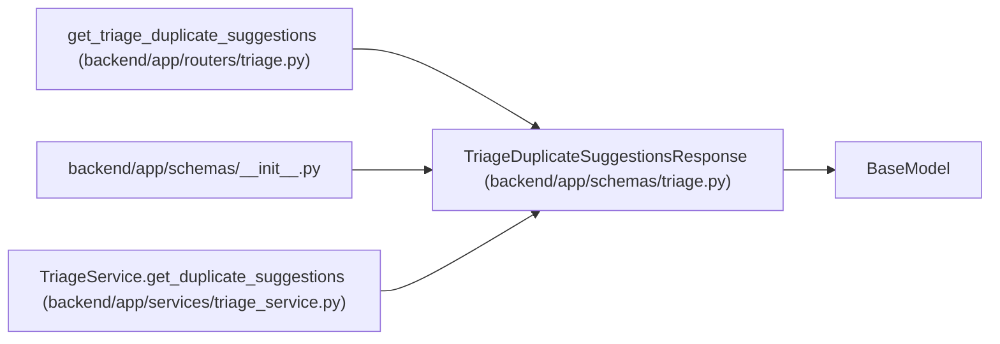

# TriageDuplicateSuggestionsResponse

**Location:** `backend/app/schemas/triage.py:151`
**Kind:** Pydantic model
**Bases:** `BaseModel`
**Module:** [schemas_triage](../modules/schemas_triage.md)

## Description

Response for advisory duplicate suggestions.

## Attributes

| Name | Type | Wire name | Required | Nullable | Default | Constraints | Examples | Description |
|------|------|-----------|----------|----------|---------|-------------|-------------|----------|
| `triage_item_id` | `int` | `triage_item_id` | Yes | No | — | — | — | — |
| `triage_items` | `list[TriageDuplicateSuggestion]` | `triage_items` | No | No | factory: `list` | — | — | — |
| `tasks` | `list[TriageDuplicateSuggestion]` | `tasks` | No | No | factory: `list` | — | — | — |

## Methods

*No public methods. Inherits from base classes.*

## Relationships

<!-- Auto-generated relationship summary. Do not edit by hand. -->

### Summary

| Module | Methods | Attributes |
|---|---:|---|
| [schemas_triage](../modules/schemas_triage.md) | 0 | `tasks`, `triage_item_id`, `triage_items` |

### Structure

| Kind | Entity | Module |
|---|---|---|
| Base | `BaseModel` | — |

### References

| Reference | Kind | Source | Call sites |
|---|---|---|---:|
| `get_triage_duplicate_suggestions` | type_reference | [routers_triage](../modules/routers_triage.md) | — |
| `__init__` | import | [schemas___init__](../modules/schemas___init__.md) | — |
| `TriageService.get_duplicate_suggestions` | call | [triage_service](../modules/triage_service.md) | 1 |
| `TriageService.get_duplicate_suggestions` | type_reference | [triage_service](../modules/triage_service.md) | — |
