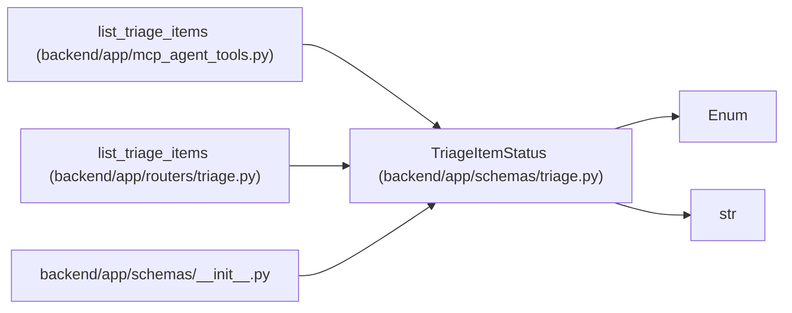

# TriageItemStatus

**Location:** `backend/app/schemas/triage.py:11`
**Kind:** Enum
**Bases:** `str`, `Enum`
**Module:** [schemas_triage](../modules/schemas_triage.md)

## Description

Triage item lifecycle status.

## Attributes

| Name | Declared value | Description |
|------|-------|-------------|
| `NEW` | `'new'` | — |
| `ACCEPTED` | `'accepted'` | — |
| `DECLINED` | `'declined'` | — |
| `DUPLICATE` | `'duplicate'` | — |
| `SNOOZED` | `'snoozed'` | — |
| `CONVERTED` | `'converted'` | — |

## Methods

*No public methods. Inherits from base classes.*

## Relationships

<!-- Auto-generated relationship summary. Do not edit by hand. -->

### Summary

| Module | Methods | Attributes |
|---|---:|---|
| [schemas_triage](../modules/schemas_triage.md) | 0 | `ACCEPTED`, `CONVERTED`, `DECLINED`, `DUPLICATE`, `NEW`, `SNOOZED` |

### Structure

| Kind | Entity | Module |
|---|---|---|
| Base | `Enum` | — |
| Base | `str` | — |

### References

| Reference | Kind | Source | Call sites |
|---|---|---|---:|
| `list_triage_items` | call | [mcp_agent_tools](../modules/mcp_agent_tools.md) | 1 |
| `list_triage_items` | type_reference | [routers_triage](../modules/routers_triage.md) | — |
| `__init__` | import | [schemas___init__](../modules/schemas___init__.md) | — |
