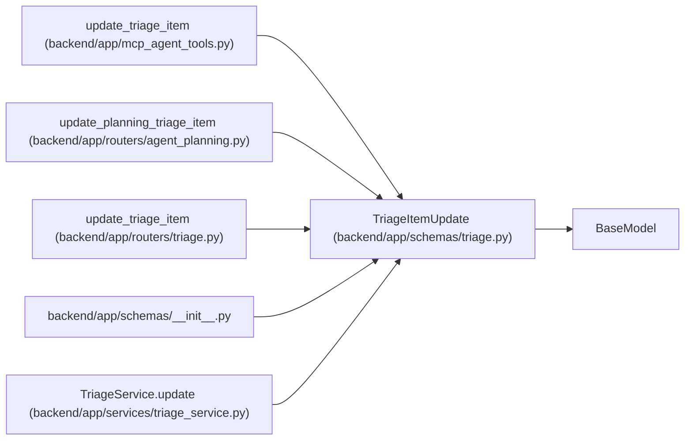

# TriageItemUpdate

**Location:** `backend/app/schemas/triage.py:69`
**Kind:** Pydantic model
**Bases:** `BaseModel`
**Module:** [schemas_triage](../modules/schemas_triage.md)

## Description

Schema for updating a triage item.

## Model Configuration

| Setting | Value | Source |
|---------|-------|--------|
| `extra` | `'forbid'` | model_config |

## Validators

| Method | Scope | Fields | Mode | Options |
|--------|-------|--------|------|---------|
| `validate_brief_metadata` | field | metadata_json | after | — |
| `validate_duplicate_target` | model | — | after | — |

## Attributes

| Name | Type | Wire name | Required | Nullable | Default | Constraints | Examples | Description |
|------|------|-----------|----------|----------|---------|-------------|-------------|----------|
| `title` | `Optional[str]` | `title` | No | Yes | `None` | max_length=500; min_length=1 | — | — |
| `description` | `Optional[str]` | `description` | No | Yes | `None` | — | — | — |
| `source` | `Optional[str]` | `source` | No | Yes | `None` | max_length=100 | — | — |
| `source_url` | `Optional[str]` | `source_url` | No | Yes | `None` | max_length=1000 | — | — |
| `external_key` | `Optional[str]` | `external_key` | No | Yes | `None` | max_length=255 | — | — |
| `status` | `Optional[TriageItemStatus]` | `status` | No | Yes | `None` | — | — | — |
| `priority_hint` | `Optional[int]` | `priority_hint` | No | Yes | `None` | ge=1; le=10 | — | — |
| `assignee_hint` | `Optional[str]` | `assignee_hint` | No | Yes | `None` | max_length=255 | — | — |
| `project_hint_id` | `Optional[int]` | `project_hint_id` | No | Yes | `None` | — | — | — |
| `iteration_hint_id` | `Optional[int]` | `iteration_hint_id` | No | Yes | `None` | — | — | — |
| `labels` | `Optional[list[str]]` | `labels` | No | Yes | `None` | — | — | — |
| `metadata_json` | `Optional[dict[str, Any]]` | `metadata_json` | No | Yes | `None` | — | — | — |
| `snoozed_until` | `Optional[datetime]` | `snoozed_until` | No | Yes | `None` | — | — | — |
| `duplicate_of_id` | `Optional[int]` | `duplicate_of_id` | No | Yes | `None` | — | — | — |
| `duplicate_task_id` | `Optional[int]` | `duplicate_task_id` | No | Yes | `None` | — | — | — |
| `converted_task_id` | `Optional[int]` | `converted_task_id` | No | Yes | `None` | — | — | — |

## Methods

| Method | Signature | Decorators | Description |
|--------|-----------|------------|-------------|
| `validate_brief_metadata` | `(value)` | `@field_validator('metadata_json')`, `@classmethod` | — |
| `validate_duplicate_target` | `()` | `@model_validator(mode='after')` | Reject ambiguous duplicate targets. |

## Relationships

<!-- Auto-generated relationship summary. Do not edit by hand. -->

### Summary

| Module | Methods | Attributes |
|---|---:|---|
| [schemas_triage](../modules/schemas_triage.md) | 2 | `assignee_hint`, `converted_task_id`, `description`, `duplicate_of_id`, `duplicate_task_id`, `external_key`, `iteration_hint_id`, `labels`, `metadata_json`, `priority_hint`, `project_hint_id`, `snoozed_until` |

### Structure

| Kind | Entity | Module |
|---|---|---|
| Base | `BaseModel` | — |

### References

| Reference | Kind | Source | Call sites |
|---|---|---|---:|
| `update_triage_item` | call | [mcp_agent_tools](../modules/mcp_agent_tools.md) | 1 |
| `update_planning_triage_item` | type_reference | [routers_agent_planning](../modules/routers_agent_planning.md) | — |
| `update_triage_item` | type_reference | [routers_triage](../modules/routers_triage.md) | — |
| `__init__` | import | [schemas___init__](../modules/schemas___init__.md) | — |
| `TriageService.update` | type_reference | [triage_service](../modules/triage_service.md) | — |
