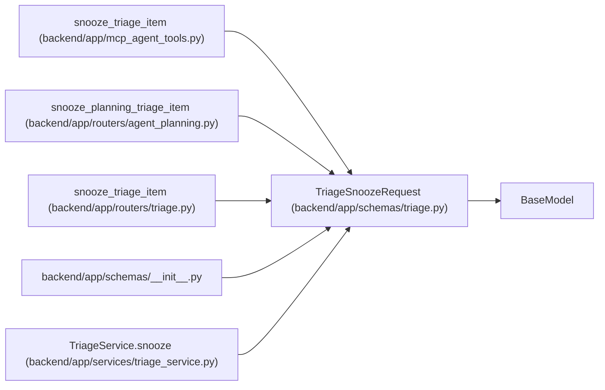

# TriageSnoozeRequest

**Location:** `backend/app/schemas/triage.py:111`
**Kind:** Pydantic model
**Bases:** `BaseModel`
**Module:** [schemas_triage](../modules/schemas_triage.md)

## Description

Request for snoozing a triage item.

## Attributes

| Name | Type | Wire name | Required | Nullable | Default | Constraints | Examples | Description |
|------|------|-----------|----------|----------|---------|-------------|-------------|----------|
| `snoozed_until` | `datetime` | `snoozed_until` | Yes | No | — | — | — | — |
| `reason` | `Optional[str]` | `reason` | No | Yes | `None` | max_length=500 | — | — |

## Methods

*No public methods. Inherits from base classes.*

## Relationships

<!-- Auto-generated relationship summary. Do not edit by hand. -->

### Summary

| Module | Methods | Attributes |
|---|---:|---|
| [schemas_triage](../modules/schemas_triage.md) | 0 | `reason`, `snoozed_until` |

### Structure

| Kind | Entity | Module |
|---|---|---|
| Base | `BaseModel` | — |

### References

| Reference | Kind | Source | Call sites |
|---|---|---|---:|
| `snooze_triage_item` | call | [mcp_agent_tools](../modules/mcp_agent_tools.md) | 1 |
| `snooze_planning_triage_item` | type_reference | [routers_agent_planning](../modules/routers_agent_planning.md) | — |
| `snooze_triage_item` | type_reference | [routers_triage](../modules/routers_triage.md) | — |
| `__init__` | import | [schemas___init__](../modules/schemas___init__.md) | — |
| `TriageService.snooze` | type_reference | [triage_service](../modules/triage_service.md) | — |
