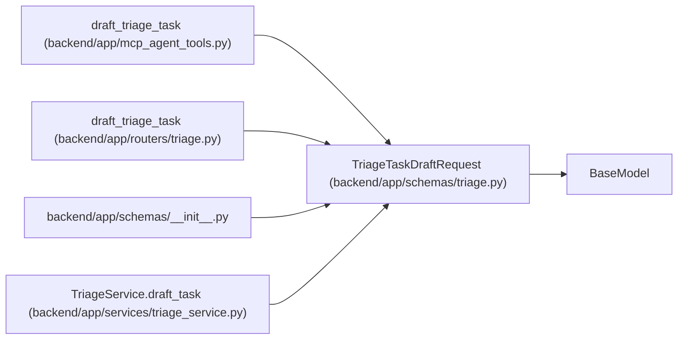

# TriageTaskDraftRequest

**Location:** `backend/app/schemas/triage.py:234`
**Kind:** Pydantic model
**Bases:** `BaseModel`
**Module:** [schemas_triage](../modules/schemas_triage.md)

## Description

Request for transient AI-assisted triage task drafting.

## Model Configuration

| Setting | Value | Source |
|---------|-------|--------|
| `extra` | `'forbid'` | model_config |

## Attributes

| Name | Type | Wire name | Required | Nullable | Default | Constraints | Examples | Description |
|------|------|-----------|----------|----------|---------|-------------|-------------|----------|
| `template_id` | `Optional[int]` | `template_id` | No | Yes | `None` | — | — | — |
| `classification_suggestion_id` | `Optional[int]` | `classification_suggestion_id` | No | Yes | `None` | — | — | — |
| `current_title` | `Optional[str]` | `current_title` | No | Yes | `None` | max_length=500 | — | — |
| `current_description` | `Optional[str]` | `current_description` | No | Yes | `None` | — | — | — |

## Methods

*No public methods. Inherits from base classes.*

## Relationships

<!-- Auto-generated relationship summary. Do not edit by hand. -->

### Summary

| Module | Methods | Attributes |
|---|---:|---|
| [schemas_triage](../modules/schemas_triage.md) | 0 | `classification_suggestion_id`, `current_description`, `current_title`, `template_id` |

### Structure

| Kind | Entity | Module |
|---|---|---|
| Base | `BaseModel` | — |

### References

| Reference | Kind | Source | Call sites |
|---|---|---|---:|
| `draft_triage_task` | call | [mcp_agent_tools](../modules/mcp_agent_tools.md) | 1 |
| `draft_triage_task` | type_reference | [routers_triage](../modules/routers_triage.md) | — |
| `__init__` | import | [schemas___init__](../modules/schemas___init__.md) | — |
| `TriageService.draft_task` | type_reference | [triage_service](../modules/triage_service.md) | — |
