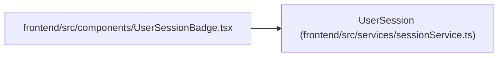

# UserSession

**Location:** `frontend/src/services/sessionService.ts:3`
**Kind:** Class
**Bases:** —
**Module:** [sessionService](../modules/sessionService.md)

## Description

_Auto-generated from `UserSession` in `frontend/src/services/sessionService.ts`._

## Attributes

| Name | Type | Default | Description |
|------|------|---------|-------------|
| `id` | `number` | *required* | — |
| `public_id` | `string` | *required* | — |
| `display_name` | `string` | *required* | — |
| `created_at` | `string` | *required* | — |
| `last_seen_at` | `string` | *required* | — |

## Methods

*No public methods. Inherits from base classes.*

## Relationships

<!-- Auto-generated relationship summary. Do not edit by hand. -->

### Summary

| Module | Methods | Attributes |
|---|---:|---|
| [sessionService](../modules/sessionService.md) | 0 | `created_at`, `display_name`, `id`, `last_seen_at`, `public_id` |

### References

| Reference | Kind | Source | Call sites |
|---|---|---|---:|
| `UserSessionBadge` | import | [UserSessionBadge](../modules/UserSessionBadge.md) | — |
