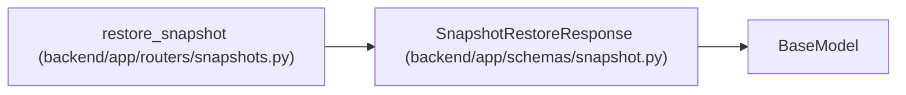

# SnapshotRestoreResponse

**Location:** `backend/app/schemas/snapshot.py:12`
**Kind:** Pydantic model
**Bases:** `BaseModel`
**Module:** [snapshot](../modules/snapshot.md)

## Description

Recoverable and auditable result of a completed snapshot restore.

## Attributes

| Name | Type | Wire name | Required | Nullable | Default | Constraints | Examples | Description |
|------|------|-----------|----------|----------|---------|-------------|-------------|----------|
| `message` | `str` | `message` | Yes | No | — | — | — | — |
| `success` | `bool` | `success` | No | No | `True` | — | — | — |
| `source_snapshot` | `str` | `source_snapshot` | Yes | No | — | — | — | — |
| `pre_restore_snapshot` | `str` | `pre_restore_snapshot` | Yes | No | — | — | — | — |
| `restored_count` | `int` | `restored_count` | Yes | No | — | — | — | — |
| `audit_event_id` | `int` | `audit_event_id` | Yes | No | — | — | — | — |

## Methods

*No public methods. Inherits from base classes.*

## Relationships

<!-- Auto-generated relationship summary. Do not edit by hand. -->

### Summary

| Module | Methods | Attributes |
|---|---:|---|
| [snapshot](../modules/snapshot.md) | 0 | `audit_event_id`, `message`, `pre_restore_snapshot`, `restored_count`, `source_snapshot`, `success` |

### Structure

| Kind | Entity | Module |
|---|---|---|
| Base | `BaseModel` | — |

### References

| Reference | Kind | Source | Call sites |
|---|---|---|---:|
| `restore_snapshot` | call | [snapshots](../modules/snapshots.md) | 1 |
| `restore_snapshot` | type_reference | [snapshots](../modules/snapshots.md) | — |
