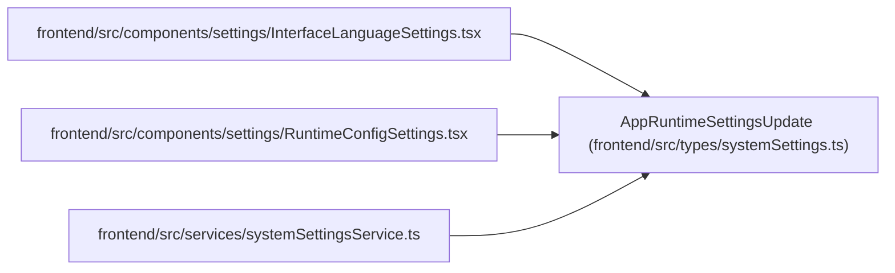

# AppRuntimeSettingsUpdate

**Location:** `frontend/src/types/systemSettings.ts:12`
**Kind:** Class
**Bases:** —
**Module:** [systemSettings](../modules/systemSettings.md)

## Description

_Auto-generated from `AppRuntimeSettingsUpdate` in `frontend/src/types/systemSettings.ts`._

## Attributes

| Name | Type | Default | Description |
|------|------|---------|-------------|
| `ui_language` | `LanguageCode` | *required* | — |
| `ai_language_mode` | `AILanguageMode` | *required* | — |
| `reset_fields` | `string[]` | *required* | — |

## Methods

*No public methods. Inherits from base classes.*

## Relationships

<!-- Auto-generated relationship summary. Do not edit by hand. -->

### Summary

| Module | Methods | Attributes |
|---|---:|---|
| [systemSettings](../modules/systemSettings.md) | 0 | `ai_language_mode`, `reset_fields`, `ui_language` |

### References

| Reference | Kind | Source | Call sites |
|---|---|---|---:|
| `InterfaceLanguageSettings` | import | [InterfaceLanguageSettings](../modules/InterfaceLanguageSettings.md) | — |
| `RuntimeConfigSettings` | import | [RuntimeConfigSettings](../modules/RuntimeConfigSettings.md) | — |
| `systemSettingsService` | import | [systemSettingsService](../modules/systemSettingsService.md) | — |
