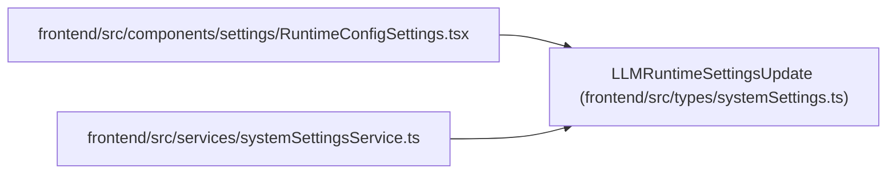

# LLMRuntimeSettingsUpdate

**Location:** `frontend/src/types/systemSettings.ts:28`
**Kind:** Class
**Bases:** —
**Module:** [systemSettings](../modules/systemSettings.md)

## Description

_Auto-generated from `LLMRuntimeSettingsUpdate` in `frontend/src/types/systemSettings.ts`._

## Attributes

| Name | Type | Default | Description |
|------|------|---------|-------------|
| `provider` | `LLMProvider` | *required* | — |
| `api_url` | `string` | *required* | — |
| `model` | `string` | *required* | — |
| `temperature` | `number` | *required* | — |
| `max_output_tokens` | `number` | *required* | — |
| `api_key` | `string \| null` | *required* | — |
| `clear_api_key` | `boolean` | *required* | — |
| `reset_fields` | `string[]` | *required* | — |

## Methods

*No public methods. Inherits from base classes.*

## Relationships

<!-- Auto-generated relationship summary. Do not edit by hand. -->

### Summary

| Module | Methods | Attributes |
|---|---:|---|
| [systemSettings](../modules/systemSettings.md) | 0 | `api_key`, `api_url`, `clear_api_key`, `max_output_tokens`, `model`, `provider`, `reset_fields`, `temperature` |

### References

| Reference | Kind | Source | Call sites |
|---|---|---|---:|
| `RuntimeConfigSettings` | import | [RuntimeConfigSettings](../modules/RuntimeConfigSettings.md) | — |
| `systemSettingsService` | import | [systemSettingsService](../modules/systemSettingsService.md) | — |
