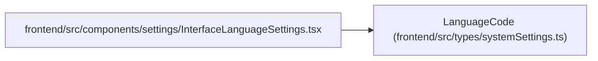

# LanguageCode

**Location:** `frontend/src/types/systemSettings.ts:3`
**Kind:** Type alias
**Bases:** —
**Module:** [systemSettings](../modules/systemSettings.md)

## Description

_Auto-generated from `LanguageCode` in `frontend/src/types/systemSettings.ts`._

## Attributes

*No annotated attributes found.*

## Methods

*No public methods. Inherits from base classes.*

## Relationships

<!-- Auto-generated relationship summary. Do not edit by hand. -->

### Summary

| Module | Methods | Attributes |
|---|---:|---|
| [systemSettings](../modules/systemSettings.md) | 0 | — |

### References

| Reference | Kind | Source | Call sites |
|---|---|---|---:|
| `InterfaceLanguageSettings` | import | [InterfaceLanguageSettings](../modules/InterfaceLanguageSettings.md) | — |
