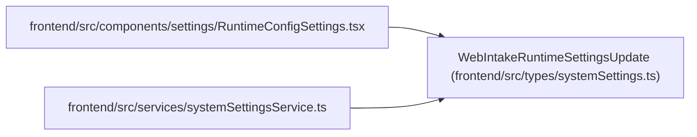

# WebIntakeRuntimeSettingsUpdate

**Location:** `frontend/src/types/systemSettings.ts:65`
**Kind:** Class
**Bases:** —
**Module:** [systemSettings](../modules/systemSettings.md)

## Description

_Auto-generated from `WebIntakeRuntimeSettingsUpdate` in `frontend/src/types/systemSettings.ts`._

## Attributes

| Name | Type | Required | Default | Description |
|------|------|----------|---------|-------------|
| `token` | `string \| null` | No | — | — |
| `clear_token` | `boolean` | No | — | — |
| `rate_limit_per_minute` | `number` | No | — | — |
| `reset_fields` | `string[]` | No | — | — |

## Methods

*No public methods. Inherits from base classes.*

## Relationships

<!-- Auto-generated relationship summary. Do not edit by hand. -->

### Summary

| Module | Methods | Attributes |
|---|---:|---|
| [systemSettings](../modules/systemSettings.md) | 0 | `clear_token`, `rate_limit_per_minute`, `reset_fields`, `token` |

### References

| Reference | Kind | Source | Call sites |
|---|---|---|---:|
| `RuntimeConfigSettings` | import | [RuntimeConfigSettings](../modules/RuntimeConfigSettings.md) | — |
| `systemSettingsService` | import | [systemSettingsService](../modules/systemSettingsService.md) | — |
