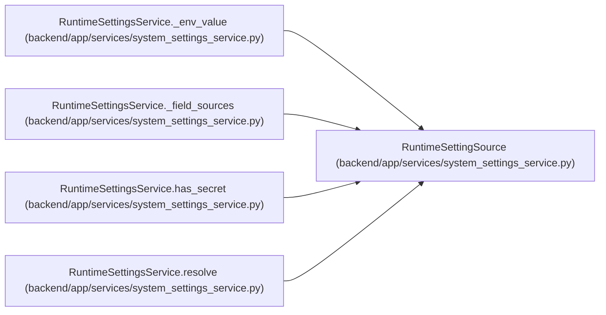

# RuntimeSettingSource

**Location:** `backend/app/services/system_settings_service.py:31`
**Kind:** Type alias
**Bases:** —
**Module:** [system_settings_service](../modules/system_settings_service.md)
**Target:** `Literal['runtime', 'environment', 'default']`

## Description

_Auto-generated from `RuntimeSettingSource` in `backend/app/services/system_settings_service.py`._

## Attributes

*No annotated attributes found.*

## Methods

*No public methods. Inherits from base classes.*

## Relationships

<!-- Auto-generated relationship summary. Do not edit by hand. -->

### Summary

| Module | Methods | Attributes |
|---|---:|---|
| [system_settings_service](../modules/system_settings_service.md) | 0 | — |

### References

| Reference | Kind | Source | Call sites |
|---|---|---|---:|
| `RuntimeSettingsService._env_value` | type_reference | [system_settings_service](../modules/system_settings_service.md) | — |
| `RuntimeSettingsService._field_sources` | type_reference | [system_settings_service](../modules/system_settings_service.md) | — |
| `RuntimeSettingsService.has_secret` | type_reference | [system_settings_service](../modules/system_settings_service.md) | — |
| `RuntimeSettingsService.resolve` | type_reference | [system_settings_service](../modules/system_settings_service.md) | — |
