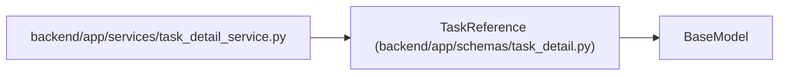

# TaskReference

**Location:** `backend/app/schemas/task_detail.py:7`
**Kind:** Pydantic model
**Bases:** `BaseModel`
**Module:** [task_detail](../modules/task_detail.md)

## Description

_Auto-generated from `TaskReference` in `backend/app/schemas/task_detail.py`._

## Model Configuration

| Setting | Value | Source |
|---------|-------|--------|
| `from_attributes` | `True` | model_config |

## Attributes

| Name | Type | Wire name | Required | Nullable | Default | Constraints | Examples | Description |
|------|------|-----------|----------|----------|---------|-------------|-------------|----------|
| `id` | `int` | `id` | Yes | No | — | — | — | — |
| `title` | `str` | `title` | Yes | No | — | — | — | — |
| `version` | `int` | `version` | Yes | No | — | — | — | — |
| `status` | `str` | `status` | Yes | No | — | — | — | — |
| `project_id` | `int \| None` | `project_id` | Yes | Yes | — | — | — | — |
| `iteration_id` | `int \| None` | `iteration_id` | Yes | Yes | — | — | — | — |
| `parent_id` | `int \| None` | `parent_id` | Yes | Yes | — | — | — | — |
| `owner_profile_id` | `int \| None` | `owner_profile_id` | Yes | Yes | — | — | — | — |

## Methods

*No public methods. Inherits from base classes.*

## Relationships

<!-- Auto-generated relationship summary. Do not edit by hand. -->

### Summary

| Module | Methods | Attributes |
|---|---:|---|
| [task_detail](../modules/task_detail.md) | 0 | `id`, `iteration_id`, `owner_profile_id`, `parent_id`, `project_id`, `status`, `title`, `version` |

### Structure

| Kind | Entity | Module |
|---|---|---|
| Base | `BaseModel` | — |

### References

| Reference | Kind | Source | Call sites |
|---|---|---|---:|
| `task_detail_service` | import | [task_detail_service](../modules/task_detail_service.md) | — |
