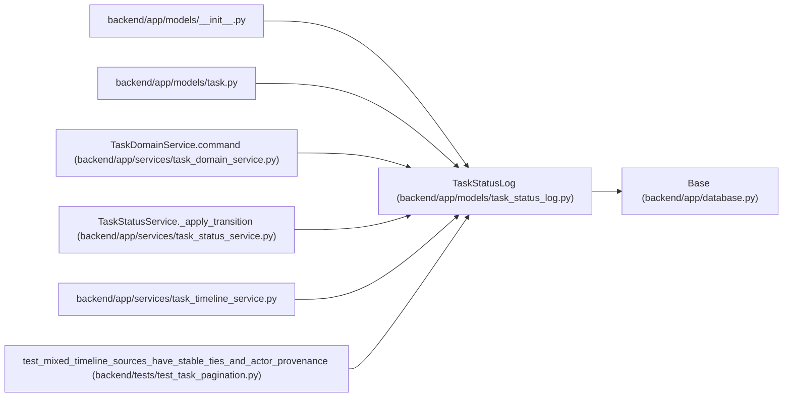

# TaskStatusLog

**Location:** `backend/app/models/task_status_log.py:15`
**Kind:** Class
**Bases:** `Base`
**Module:** [task_status_log](../modules/task_status_log.md)

## Description

Audit log for task status changes.

Records all status transitions with timestamp, reason, and affected tasks.

## Attributes

| Name | Type | Default | Description |
|------|------|---------|-------------|
| `id` | `Mapped[int]` | `mapped_column(Integer, primary_key=True, autoincrement=True)` | — |
| `task_id` | `Mapped[int]` | `mapped_column(Integer, ForeignKey('tasks.id', ondelete='CASCADE'), nullable=False)` | — |
| `from_status` | `Mapped[str]` | `mapped_column(String(50), nullable=False)` | — |
| `to_status` | `Mapped[str]` | `mapped_column(String(50), nullable=False)` | — |
| `changed_at` | `Mapped[datetime]` | `mapped_column(UTCDateTime(), default=utc_now, nullable=False)` | — |
| `reason` | `Mapped[Optional[str]]` | `mapped_column(Text, nullable=True)` | — |
| `triggered_by` | `Mapped[str]` | `mapped_column(String(50), default='user', nullable=False)` | — |
| `affected_task_ids` | `Mapped[Optional[str]]` | `mapped_column(Text, nullable=True)` | — |
| `task` | `Mapped['Task']` | `relationship('Task', back_populates='status_logs')` | — |

## Methods

*No public methods. Inherits from base classes.*

## Relationships

<!-- Auto-generated relationship summary. Do not edit by hand. -->

### Summary

| Module | Methods | Attributes |
|---|---:|---|
| [task_status_log](../modules/task_status_log.md) | 0 | `affected_task_ids`, `changed_at`, `from_status`, `id`, `reason`, `task`, `task_id`, `to_status`, `triggered_by` |

### Structure

| Kind | Entity | Module |
|---|---|---|
| Base | `Base` | [app_database](../modules/app_database.md) |

### References

| Reference | Kind | Source | Call sites |
|---|---|---|---:|
| `__init__` | import | [models___init__](../modules/models___init__.md) | — |
| `task` | import | [models_task](../modules/models_task.md) | — |
| `TaskDomainService.command` | call | [task_domain_service](../modules/task_domain_service.md) | 1 |
| `TaskStatusService._apply_transition` | call | [task_status_service](../modules/task_status_service.md) | 1 |
| `task_timeline_service` | import | [task_timeline_service](../modules/task_timeline_service.md) | — |
| `test_mixed_timeline_sources_have_stable_ties_and_actor_provenance` | call | [test_task_pagination](../modules/test_task_pagination.md) | 1 |
