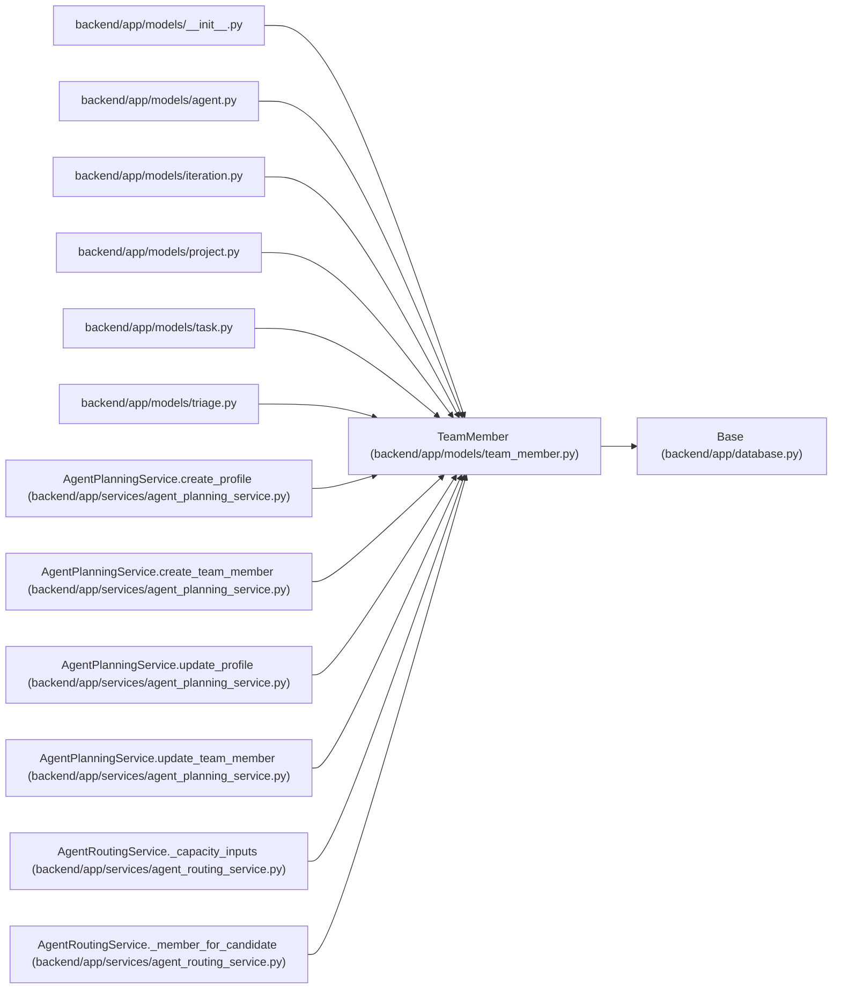

# TeamMember

**Location:** `backend/app/models/team_member.py:18`
**Kind:** Class
**Bases:** `Base`
**Module:** [team_member](../modules/team_member.md)

## Description

Team member model with availability and capacity settings.

## Attributes

| Name | Type | Default | Description |
|------|------|---------|-------------|
| `id` | `Mapped[int]` | `mapped_column(Integer, primary_key=True, autoincrement=True)` | — |
| `name` | `Mapped[str]` | `mapped_column(String(255), nullable=False)` | — |
| `position` | `Mapped[str]` | `mapped_column(String(255), nullable=False)` | — |
| `email` | `Mapped[Optional[str]]` | `mapped_column(String(255), nullable=True)` | — |
| `availability_percent` | `Mapped[float]` | `mapped_column(Float, default=100.0)` | — |
| `professionalism_coefficient` | `Mapped[float]` | `mapped_column(Float, default=1.0)` | — |
| `operational_utilization` | `Mapped[float]` | `mapped_column(Float, default=20.0)` | — |
| `iteration_id` | `Mapped[int \| None]` | `mapped_column(Integer, ForeignKey('iterations.id', ondelete='SET NULL'), nullable=True)` | — |
| `profile_id` | `Mapped[int \| None]` | `mapped_column(Integer, ForeignKey('team_member_profiles.id', ondelete='SET NULL'), nullable=True, index=True)` | — |
| `iteration` | `Mapped['Iteration \| None']` | `relationship('Iteration', back_populates='team_members')` | — |
| `profile` | `Mapped['TeamMemberProfile \| None']` | `relationship('TeamMemberProfile', back_populates='team_members')` | — |
| `vacations` | `Mapped[list['Vacation']]` | `relationship('Vacation', back_populates='team_member', cascade='all, delete-orphan')` | — |
| `tasks` | `Mapped[list['Task']]` | `relationship('Task', back_populates='assignee')` | — |
| `owned_projects` | `Mapped[list['Project']]` | `relationship('Project', back_populates='owner')` | — |
| `owned_initiatives` | `Mapped[list['Initiative']]` | `relationship('Initiative', back_populates='owner')` | — |

## Methods

| Method | Signature | Decorators | Description |
|--------|-----------|------------|-------------|
| `iteration_name` | `() -> str \| None` | `@property` | Return the iteration display name for compact owner selectors. |

## Relationships

<!-- Auto-generated relationship summary. Do not edit by hand. -->

### Summary

| Module | Methods | Attributes |
|---|---:|---|
| [team_member](../modules/team_member.md) | 1 | `availability_percent`, `email`, `id`, `iteration`, `iteration_id`, `name`, `operational_utilization`, `owned_initiatives`, `owned_projects`, `position`, `professionalism_coefficient`, `profile` |

### Structure

| Kind | Entity | Module |
|---|---|---|
| Base | `Base` | [app_database](../modules/app_database.md) |

### References

| Reference | Kind | Source | Call sites |
|---|---|---|---:|
| `__init__` | import | [models___init__](../modules/models___init__.md) | — |
| `agent` | import | [models_agent](../modules/models_agent.md) | — |
| `iteration` | import | [models_iteration](../modules/models_iteration.md) | — |
| `project` | import | [models_project](../modules/models_project.md) | — |
| `task` | import | [models_task](../modules/models_task.md) | — |
| `triage` | import | [models_triage](../modules/models_triage.md) | — |
| `AgentPlanningService.create_profile` | type_reference | [agent_planning_service](../modules/agent_planning_service.md) | — |
| `AgentPlanningService.create_team_member` | type_reference | [agent_planning_service](../modules/agent_planning_service.md) | — |
| `AgentPlanningService.update_profile` | type_reference | [agent_planning_service](../modules/agent_planning_service.md) | — |
| `AgentPlanningService.update_team_member` | type_reference | [agent_planning_service](../modules/agent_planning_service.md) | — |
| `AgentRoutingService._capacity_inputs` | type_reference | [agent_routing_service](../modules/agent_routing_service.md) | — |
| `AgentRoutingService._member_for_candidate` | type_reference | [agent_routing_service](../modules/agent_routing_service.md) | — |

> References: showing 12 of 63 logical references; 51 omitted by the 12-row generated summary limit.
