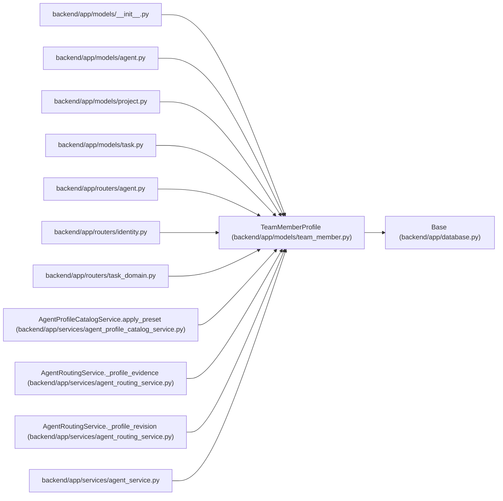

# TeamMemberProfile

**Location:** `backend/app/models/team_member.py:71`
**Kind:** Class
**Bases:** `Base`
**Module:** [team_member](../modules/team_member.md)

## Description

Reusable person profile for durable capability and preference metadata.

## Attributes

| Name | Type | Default | Description |
|------|------|---------|-------------|
| `id` | `Mapped[int]` | `mapped_column(Integer, primary_key=True, autoincrement=True)` | — |
| `profile_token` | `Mapped[str]` | `mapped_column(String(36), nullable=False, default=lambda: str(uuid4()))` | — |
| `seed_key` | `Mapped[Optional[str]]` | `mapped_column(String(120), nullable=True, unique=True, index=True)` | — |
| `display_name` | `Mapped[str]` | `mapped_column(String(255), nullable=False)` | — |
| `email` | `Mapped[Optional[str]]` | `mapped_column(String(255), nullable=True)` | — |
| `headline` | `Mapped[Optional[str]]` | `mapped_column(String(255), nullable=True)` | — |
| `summary` | `Mapped[Optional[str]]` | `mapped_column(Text, nullable=True)` | — |
| `notes` | `Mapped[Optional[str]]` | `mapped_column(Text, nullable=True)` | — |
| `automation_enabled` | `Mapped[bool]` | `mapped_column(Boolean, default=True, nullable=False)` | — |
| `profile_kind` | `Mapped[str]` | `mapped_column(String(30), default='human', nullable=False)` | — |
| `assignment_modes` | `Mapped[list[Any]]` | `mapped_column(JSON, default=list, nullable=False)` | — |
| `created_at` | `Mapped[datetime]` | `mapped_column(UTCDateTime(), default=utc_now, nullable=False)` | — |
| `updated_at` | `Mapped[datetime]` | `mapped_column(UTCDateTime(), default=utc_now, onupdate=utc_now, nullable=False)` | — |
| `skills` | `Mapped[list['TeamMemberProfileSkill']]` | `relationship('TeamMemberProfileSkill', back_populates='profile', cascade='all, delete-orphan', order_by='TeamMemberProfileSkill.category, TeamMemberProfileSkill.skill_name, TeamMemberProfileSkill.id')` | — |
| `team_members` | `Mapped[list['TeamMember']]` | `relationship('TeamMember', back_populates='profile', passive_deletes=True)` | — |
| `agent_actors` | `Mapped[list['AgentActor']]` | `relationship('AgentActor', back_populates='profile', passive_deletes=True)` | — |
| `owned_projects` | `Mapped[list['Project']]` | `relationship('Project', back_populates='owner_profile', passive_deletes=True)` | — |
| `owned_initiatives` | `Mapped[list['Initiative']]` | `relationship('Initiative', back_populates='owner_profile', passive_deletes=True)` | — |

## Methods

*No public methods. Inherits from base classes.*

## Relationships

<!-- Auto-generated relationship summary. Do not edit by hand. -->

### Summary

| Module | Methods | Attributes |
|---|---:|---|
| [team_member](../modules/team_member.md) | 0 | `agent_actors`, `assignment_modes`, `automation_enabled`, `created_at`, `display_name`, `email`, `headline`, `id`, `notes`, `owned_initiatives`, `owned_projects`, `profile_kind` |

### Structure

| Kind | Entity | Module |
|---|---|---|
| Base | `Base` | [app_database](../modules/app_database.md) |

### References

| Reference | Kind | Source | Call sites |
|---|---|---|---:|
| `__init__` | import | [models___init__](../modules/models___init__.md) | — |
| `agent` | import | [models_agent](../modules/models_agent.md) | — |
| `project` | import | [models_project](../modules/models_project.md) | — |
| `task` | import | [models_task](../modules/models_task.md) | — |
| `agent` | import | [routers_agent](../modules/routers_agent.md) | — |
| `identity` | import | [routers_identity](../modules/routers_identity.md) | — |
| `task_domain` | import | [routers_task_domain](../modules/routers_task_domain.md) | — |
| `AgentProfileCatalogService.apply_preset` | call | [agent_profile_catalog_service](../modules/agent_profile_catalog_service.md) | 1 |
| `AgentProfileCatalogService.apply_preset` | type_reference | [agent_profile_catalog_service](../modules/agent_profile_catalog_service.md) | — |
| `AgentRoutingService._profile_evidence` | type_reference | [agent_routing_service](../modules/agent_routing_service.md) | — |
| `AgentRoutingService._profile_revision` | type_reference | [agent_routing_service](../modules/agent_routing_service.md) | — |
| `agent_service` | import | [agent_service](../modules/agent_service.md) | — |

> References: showing 12 of 70 logical references; 58 omitted by the 12-row generated summary limit.
