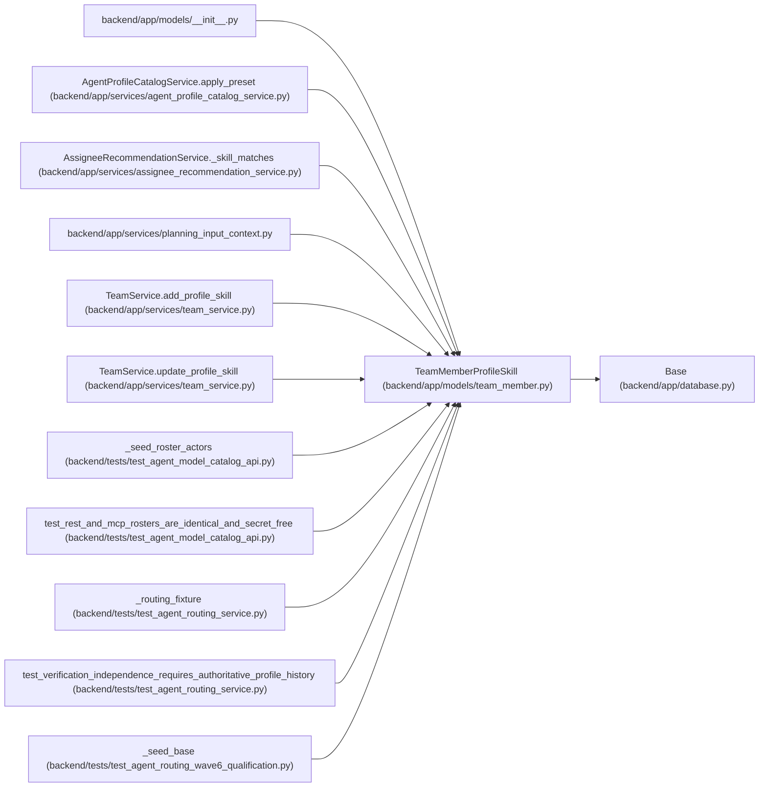

# TeamMemberProfileSkill

**Location:** `backend/app/models/team_member.py:122`
**Kind:** Class
**Bases:** `Base`
**Module:** [team_member](../modules/team_member.md)

## Description

Structured skill or weakness attached to a reusable team-member profile.

## Attributes

| Name | Type | Default | Description |
|------|------|---------|-------------|
| `id` | `Mapped[int]` | `mapped_column(Integer, primary_key=True, autoincrement=True)` | — |
| `profile_id` | `Mapped[int]` | `mapped_column(Integer, ForeignKey('team_member_profiles.id', ondelete='CASCADE'), nullable=False)` | — |
| `skill_key` | `Mapped[str]` | `mapped_column(String(120), nullable=False)` | — |
| `skill_name` | `Mapped[str]` | `mapped_column(String(255), nullable=False)` | — |
| `category` | `Mapped[Optional[str]]` | `mapped_column(String(120), nullable=True)` | — |
| `level` | `Mapped[int]` | `mapped_column(Integer, default=3, nullable=False)` | — |
| `interest` | `Mapped[int]` | `mapped_column(Integer, default=3, nullable=False)` | — |
| `is_weakness` | `Mapped[bool]` | `mapped_column(Boolean, default=False, nullable=False)` | — |
| `keywords_json` | `Mapped[list[Any]]` | `mapped_column(JSON, default=list, nullable=False)` | — |
| `notes` | `Mapped[Optional[str]]` | `mapped_column(Text, nullable=True)` | — |
| `created_at` | `Mapped[datetime]` | `mapped_column(UTCDateTime(), default=utc_now, nullable=False)` | — |
| `updated_at` | `Mapped[datetime]` | `mapped_column(UTCDateTime(), default=utc_now, onupdate=utc_now, nullable=False)` | — |
| `profile` | `Mapped['TeamMemberProfile']` | `relationship('TeamMemberProfile', back_populates='skills')` | — |

## Methods

*No public methods. Inherits from base classes.*

## Relationships

<!-- Auto-generated relationship summary. Do not edit by hand. -->

### Summary

| Module | Methods | Attributes |
|---|---:|---|
| [team_member](../modules/team_member.md) | 0 | `category`, `created_at`, `id`, `interest`, `is_weakness`, `keywords_json`, `level`, `notes`, `profile`, `profile_id`, `skill_key`, `skill_name` |

### Structure

| Kind | Entity | Module |
|---|---|---|
| Base | `Base` | [app_database](../modules/app_database.md) |

### References

| Reference | Kind | Source | Call sites |
|---|---|---|---:|
| `__init__` | import | [models___init__](../modules/models___init__.md) | — |
| `AgentProfileCatalogService.apply_preset` | call | [agent_profile_catalog_service](../modules/agent_profile_catalog_service.md) | 2 |
| `AssigneeRecommendationService._skill_matches` | type_reference | [assignee_recommendation_service](../modules/assignee_recommendation_service.md) | — |
| `planning_input_context` | import | [planning_input_context](../modules/planning_input_context.md) | — |
| `TeamService.add_profile_skill` | call | [team_service](../modules/team_service.md) | 1 |
| `TeamService.add_profile_skill` | type_reference | [team_service](../modules/team_service.md) | — |
| `TeamService.update_profile_skill` | type_reference | [team_service](../modules/team_service.md) | — |
| `_seed_roster_actors` | call | [test_agent_model_catalog_api](../modules/test_agent_model_catalog_api.md) | 1 |
| `test_rest_and_mcp_rosters_are_identical_and_secret_free` | call | [test_agent_model_catalog_api](../modules/test_agent_model_catalog_api.md) | 1 |
| `_routing_fixture` | call | [test_agent_routing_service](../modules/test_agent_routing_service.md) | 1 |
| `test_verification_independence_requires_authoritative_profile_history` | call | [test_agent_routing_service](../modules/test_agent_routing_service.md) | 1 |
| `_seed_base` | call | [test_agent_routing_wave6_qualification](../modules/test_agent_routing_wave6_qualification.md) | 1 |

> References: showing 12 of 15 logical references; 3 omitted by the 12-row generated summary limit.
