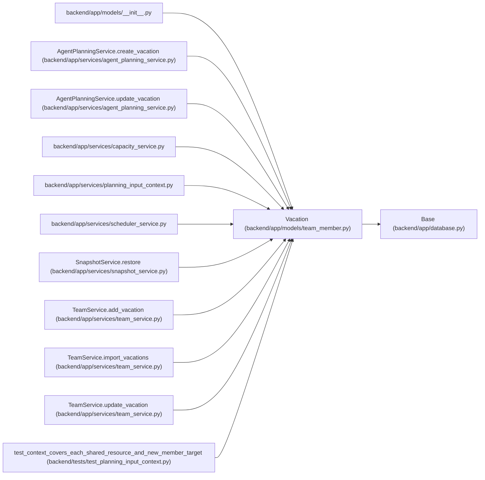

# Vacation

**Location:** `backend/app/models/team_member.py:164`
**Kind:** Class
**Bases:** `Base`
**Module:** [team_member](../modules/team_member.md)

## Description

Vacation period for a team member.

## Attributes

| Name | Type | Default | Description |
|------|------|---------|-------------|
| `id` | `Mapped[int]` | `mapped_column(Integer, primary_key=True, autoincrement=True)` | — |
| `start_date` | `Mapped[date]` | `mapped_column(Date, nullable=False)` | — |
| `end_date` | `Mapped[date]` | `mapped_column(Date, nullable=False)` | — |
| `team_member_id` | `Mapped[int]` | `mapped_column(Integer, ForeignKey('team_members.id'), nullable=False)` | — |
| `profile_absence_id` | `Mapped[int \| None]` | `mapped_column(ForeignKey('profile_absences.id', ondelete='RESTRICT'), nullable=True, index=True)` | — |
| `team_member` | `Mapped['TeamMember']` | `relationship('TeamMember', back_populates='vacations')` | — |

## Methods

*No public methods. Inherits from base classes.*

## Relationships

<!-- Auto-generated relationship summary. Do not edit by hand. -->

### Summary

| Module | Methods | Attributes |
|---|---:|---|
| [team_member](../modules/team_member.md) | 0 | `end_date`, `id`, `profile_absence_id`, `start_date`, `team_member`, `team_member_id` |

### Structure

| Kind | Entity | Module |
|---|---|---|
| Base | `Base` | [app_database](../modules/app_database.md) |

### References

| Reference | Kind | Source | Call sites |
|---|---|---|---:|
| `__init__` | import | [models___init__](../modules/models___init__.md) | — |
| `AgentPlanningService.create_vacation` | type_reference | [agent_planning_service](../modules/agent_planning_service.md) | — |
| `AgentPlanningService.update_vacation` | type_reference | [agent_planning_service](../modules/agent_planning_service.md) | — |
| `capacity_service` | import | [capacity_service](../modules/capacity_service.md) | — |
| `planning_input_context` | import | [planning_input_context](../modules/planning_input_context.md) | — |
| `scheduler_service` | import | [scheduler_service](../modules/scheduler_service.md) | — |
| `SnapshotService.restore` | call | [snapshot_service](../modules/snapshot_service.md) | 1 |
| `TeamService.add_vacation` | call | [team_service](../modules/team_service.md) | 1 |
| `TeamService.add_vacation` | type_reference | [team_service](../modules/team_service.md) | — |
| `TeamService.import_vacations` | type_reference | [team_service](../modules/team_service.md) | — |
| `TeamService.update_vacation` | type_reference | [team_service](../modules/team_service.md) | — |
| `test_context_covers_each_shared_resource_and_new_member_target` | call | [test_planning_input_context](../modules/test_planning_input_context.md) | 1 |

> References: showing 12 of 16 logical references; 4 omitted by the 12-row generated summary limit.
