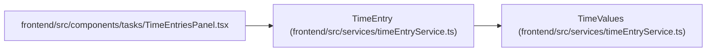

# TimeEntry

**Location:** `frontend/src/services/timeEntryService.ts:4`
**Kind:** Class
**Bases:** `TimeValues`
**Module:** [timeEntryService](../modules/timeEntryService.md)

## Description

_Auto-generated from `TimeEntry` in `frontend/src/services/timeEntryService.ts`._

## Attributes

| Name | Type | Required | Default | Description |
|------|------|----------|---------|-------------|
| `id` | `number` | Yes | — | — |
| `project_id` | `number` | Yes | — | — |
| `task_id` | `number \| null` | Yes | — | — |
| `task_title` | `string \| null` | Yes | — | — |
| `principal_id` | `number` | Yes | — | — |
| `version` | `number` | Yes | — | — |
| `voided` | `boolean` | Yes | — | — |
| `created_at` | `string` | Yes | — | — |
| `updated_at` | `string` | Yes | — | — |

## Methods

*No public methods. Inherits from base classes.*

## Relationships

<!-- Auto-generated relationship summary. Do not edit by hand. -->

### Summary

| Module | Methods | Attributes |
|---|---:|---|
| [timeEntryService](../modules/timeEntryService.md) | 0 | `created_at`, `id`, `principal_id`, `project_id`, `task_id`, `task_title`, `updated_at`, `version`, `voided` |

### Structure

| Kind | Entity | Module |
|---|---|---|
| Base | `TimeValues` | [timeEntryService](../modules/timeEntryService.md) |

### References

| Reference | Kind | Source | Call sites |
|---|---|---|---:|
| `TimeEntriesPanel` | import | [TimeEntriesPanel](../modules/TimeEntriesPanel.md) | — |
