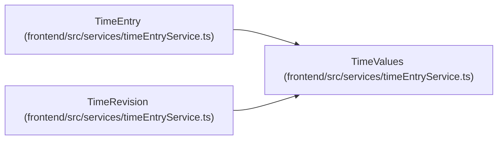

# TimeValues

**Location:** `frontend/src/services/timeEntryService.ts:3`
**Kind:** Class
**Bases:** —
**Module:** [timeEntryService](../modules/timeEntryService.md)

## Description

_Auto-generated from `TimeValues` in `frontend/src/services/timeEntryService.ts`._

## Attributes

| Name | Type | Required | Default | Description |
|------|------|----------|---------|-------------|
| `work_date` | `string` | Yes | — | — |
| `timezone` | `string` | Yes | — | — |
| `minutes` | `number` | Yes | — | — |
| `note` | `string` | Yes | — | — |

## Methods

*No public methods. Inherits from base classes.*

## Relationships

<!-- Auto-generated relationship summary. Do not edit by hand. -->

### Summary

| Module | Methods | Attributes |
|---|---:|---|
| [timeEntryService](../modules/timeEntryService.md) | 0 | `minutes`, `note`, `timezone`, `work_date` |

### Structure

| Kind | Entity | Module |
|---|---|---|
| Subclass | `TimeEntry` | [timeEntryService](../modules/timeEntryService.md) |
| Subclass | `TimeRevision` | [timeEntryService](../modules/timeEntryService.md) |
