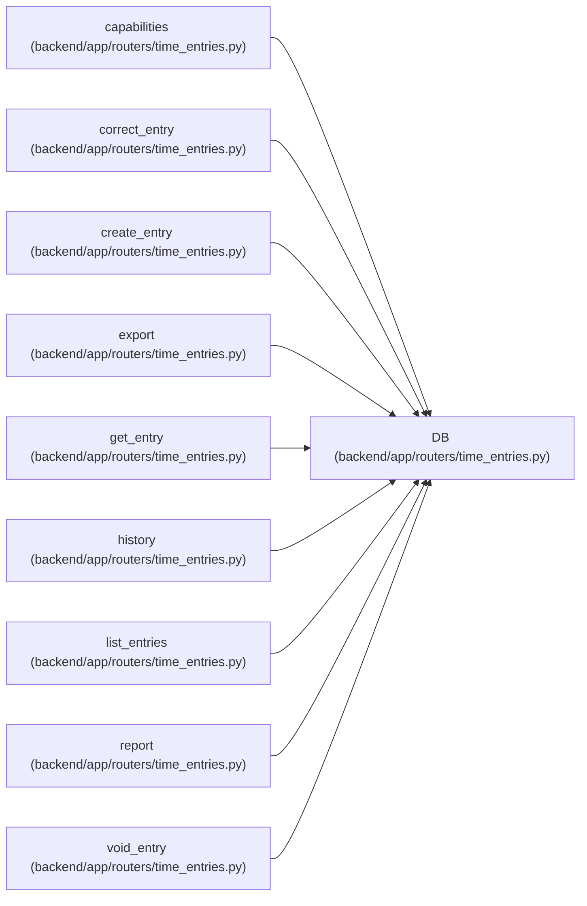

# DB

**Location:** `backend/app/routers/time_entries.py:24`
**Kind:** Type alias
**Bases:** —
**Module:** [time_entries](../modules/time_entries.md)
**Target:** `Annotated[AsyncSession, Depends(get_db, scope='function')]`

## Description

_Auto-generated from `DB` in `backend/app/routers/time_entries.py`._

## Attributes

*No annotated attributes found.*

## Methods

*No public methods. Inherits from base classes.*

## Relationships

<!-- Auto-generated relationship summary. Do not edit by hand. -->

### Summary

| Module | Methods | Attributes |
|---|---:|---|
| [time_entries](../modules/time_entries.md) | 0 | — |

### References

| Reference | Kind | Source | Call sites |
|---|---|---|---:|
| `capabilities` | type_reference | [time_entries](../modules/time_entries.md) | — |
| `correct_entry` | type_reference | [time_entries](../modules/time_entries.md) | — |
| `create_entry` | type_reference | [time_entries](../modules/time_entries.md) | — |
| `export` | type_reference | [time_entries](../modules/time_entries.md) | — |
| `get_entry` | type_reference | [time_entries](../modules/time_entries.md) | — |
| `history` | type_reference | [time_entries](../modules/time_entries.md) | — |
| `list_entries` | type_reference | [time_entries](../modules/time_entries.md) | — |
| `report` | type_reference | [time_entries](../modules/time_entries.md) | — |
| `void_entry` | type_reference | [time_entries](../modules/time_entries.md) | — |
