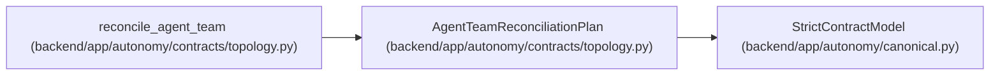

# AgentTeamReconciliationPlan

**Location:** `backend/app/autonomy/contracts/topology.py:268`
**Kind:** Pydantic model
**Bases:** `StrictContractModel`
**Module:** [topology](../modules/topology.md)

## Description

_Auto-generated from `AgentTeamReconciliationPlan` in `backend/app/autonomy/contracts/topology.py`._

## Attributes

| Name | Type | Wire name | Required | Nullable | Default | Constraints | Examples | Description |
|------|------|-----------|----------|----------|---------|-------------|-------------|----------|
| `schema_version` | `Literal['agent-team-reconciliation-plan-v1']` | `schema_version` | No | No | `'agent-team-reconciliation-plan-v1'` | — | — | — |
| `topology_key` | `str` | `topology_key` | Yes | No | — | pattern=unknown (LOGICAL_KEY_PATTERN) | — | — |
| `expected_topology_revision` | `int` | `expected_topology_revision` | Yes | No | — | ge=0 | — | — |
| `manifest_digest` | `str` | `manifest_digest` | Yes | No | — | pattern=unknown (SHA256_PATTERN) | — | — |
| `actions` | `tuple[TopologyPlanAction, ...]` | `actions` | Yes | No | — | max_length=1024 | — | — |
| `plan_digest` | `str` | `plan_digest` | Yes | No | — | pattern=unknown (SHA256_PATTERN) | — | — |

## Methods

*No public methods. Inherits from base classes.*

## Relationships

<!-- Auto-generated relationship summary. Do not edit by hand. -->

### Summary

| Module | Methods | Attributes |
|---|---:|---|
| [topology](../modules/topology.md) | 0 | `actions`, `expected_topology_revision`, `manifest_digest`, `plan_digest`, `schema_version`, `topology_key` |

### Structure

| Kind | Entity | Module |
|---|---|---|
| Base | `StrictContractModel` | [autonomy_canonical](../modules/autonomy_canonical.md) |

### References

| Reference | Kind | Source | Call sites |
|---|---|---|---:|
| `reconcile_agent_team` | call | [topology](../modules/topology.md) | 1 |
| `reconcile_agent_team` | type_reference | [topology](../modules/topology.md) | — |
