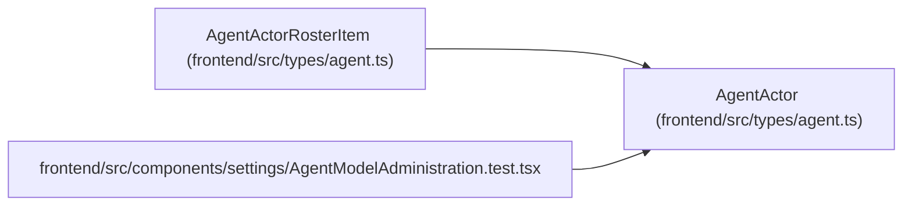

# AgentActor

**Location:** `frontend/src/types/agent.ts:100`
**Kind:** Class
**Bases:** —
**Module:** [types_agent](../modules/types_agent.md)

## Description

_Auto-generated from `AgentActor` in `frontend/src/types/agent.ts`._

## Attributes

| Name | Type | Default | Description |
|------|------|---------|-------------|
| `id` | `number` | *required* | — |
| `name` | `string` | *required* | — |
| `display_name` | `string` | *required* | — |
| `scopes` | `string[]` | *required* | — |
| `enabled` | `boolean` | *required* | — |
| `lifecycle_state` | `'active' \| 'onboarding' \| 'disabled'` | *required* | — |
| `role` | `AgentActorRole \| string` | *required* | — |
| `profile_id` | `number \| null` | *required* | — |
| `work_policy` | `string` | *required* | — |
| `max_parallel_work` | `number` | *required* | — |
| `queue_revision` | `number` | *required* | — |
| `created_at` | `string` | *required* | — |
| `last_seen_at` | `string \| null` | *required* | — |

## Methods

*No public methods. Inherits from base classes.*

## Relationships

<!-- Auto-generated relationship summary. Do not edit by hand. -->

### Summary

| Module | Methods | Attributes |
|---|---:|---|
| [types_agent](../modules/types_agent.md) | 0 | `created_at`, `display_name`, `enabled`, `id`, `last_seen_at`, `lifecycle_state`, `max_parallel_work`, `name`, `profile_id`, `queue_revision`, `role`, `scopes` |

### Structure

| Kind | Entity | Module |
|---|---|---|
| Subclass | `AgentActorRosterItem` | [types_agent](../modules/types_agent.md) |

### References

| Reference | Kind | Source | Call sites |
|---|---|---|---:|
| `AgentModelAdministration.test` | import | [AgentModelAdministration.test](../modules/AgentModelAdministration.test.md) | — |
