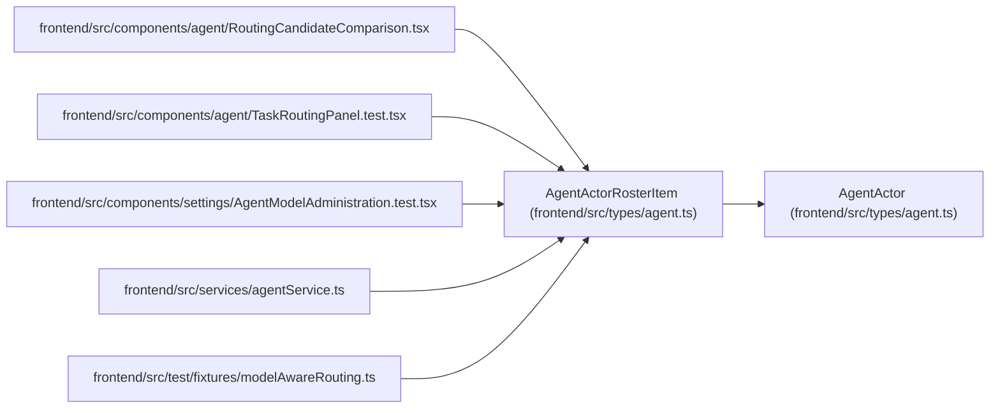

# AgentActorRosterItem

**Location:** `frontend/src/types/agent.ts:298`
**Kind:** Class
**Bases:** `AgentActor`
**Module:** [types_agent](../modules/types_agent.md)

## Description

_Auto-generated from `AgentActorRosterItem` in `frontend/src/types/agent.ts`._

## Attributes

| Name | Type | Default | Description |
|------|------|---------|-------------|
| `actor_revision` | `number` | *required* | — |
| `profile_revision` | `string \| null` | *required* | — |
| `profile` | `AgentActorRosterProfile \| null` | *required* | — |
| `eligible_model_bindings` | `AgentModelBinding[]` | *required* | — |
| `queued_assignments` | `number` | *required* | — |
| `accepted_assignments` | `number` | *required* | — |
| `running_runs` | `number` | *required* | — |

## Methods

*No public methods. Inherits from base classes.*

## Relationships

<!-- Auto-generated relationship summary. Do not edit by hand. -->

### Summary

| Module | Methods | Attributes |
|---|---:|---|
| [types_agent](../modules/types_agent.md) | 0 | `accepted_assignments`, `actor_revision`, `eligible_model_bindings`, `profile`, `profile_revision`, `queued_assignments`, `running_runs` |

### Structure

| Kind | Entity | Module |
|---|---|---|
| Base | `AgentActor` | [types_agent](../modules/types_agent.md) |

### References

| Reference | Kind | Source | Call sites |
|---|---|---|---:|
| `RoutingCandidateComparison` | import | [RoutingCandidateComparison](../modules/RoutingCandidateComparison.md) | — |
| `TaskRoutingPanel.test` | import | [TaskRoutingPanel.test](../modules/TaskRoutingPanel.test.md) | — |
| `AgentModelAdministration.test` | import | [AgentModelAdministration.test](../modules/AgentModelAdministration.test.md) | — |
| `agentService` | import | [agentService](../modules/agentService.md) | — |
| `modelAwareRouting` | import | [modelAwareRouting](../modules/modelAwareRouting.md) | — |
