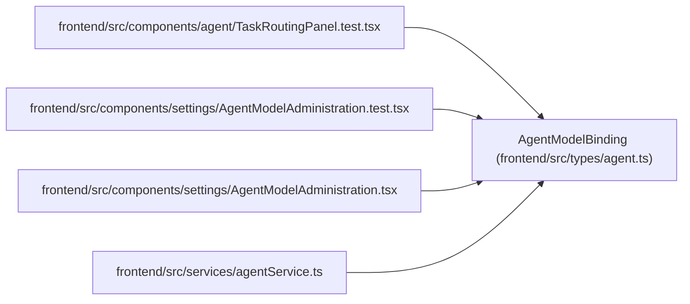

# AgentModelBinding

**Location:** `frontend/src/types/agent.ts:238`
**Kind:** Class
**Bases:** —
**Module:** [types_agent](../modules/types_agent.md)

## Description

_Auto-generated from `AgentModelBinding` in `frontend/src/types/agent.ts`._

## Attributes

| Name | Type | Required | Default | Description |
|------|------|----------|---------|-------------|
| `id` | `number` | Yes | — | — |
| `actor_id` | `number` | Yes | — | — |
| `model_catalog_id` | `number` | Yes | — | — |
| `is_default` | `boolean` | Yes | — | — |
| `enabled` | `boolean` | Yes | — | — |
| `tool_tags` | `string[]` | Yes | — | — |
| `data_policy_tags` | `string[]` | Yes | — | — |
| `revision` | `number` | Yes | — | — |
| `model_catalog_key` | `string \| null` | Yes | — | — |
| `selectable` | `boolean` | Yes | — | — |
| `model_catalog` | `AgentModelCatalogEntry \| null` | Yes | — | — |
| `live_assignment_count` | `number` | Yes | — | — |
| `historical_assignment_count` | `number` | Yes | — | — |
| `run_reference_count` | `number` | Yes | — | — |
| `created_at` | `string` | Yes | — | — |
| `updated_at` | `string` | Yes | — | — |

## Methods

*No public methods. Inherits from base classes.*

## Relationships

<!-- Auto-generated relationship summary. Do not edit by hand. -->

### Summary

| Module | Methods | Attributes |
|---|---:|---|
| [types_agent](../modules/types_agent.md) | 0 | `actor_id`, `created_at`, `data_policy_tags`, `enabled`, `historical_assignment_count`, `id`, `is_default`, `live_assignment_count`, `model_catalog`, `model_catalog_id`, `model_catalog_key`, `revision` |

### References

| Reference | Kind | Source | Call sites |
|---|---|---|---:|
| `TaskRoutingPanel.test` | import | [TaskRoutingPanel.test](../modules/TaskRoutingPanel.test.md) | — |
| `AgentModelAdministration.test` | import | [AgentModelAdministration.test](../modules/AgentModelAdministration.test.md) | — |
| `AgentModelAdministration` | import | [AgentModelAdministration](../modules/AgentModelAdministration.md) | — |
| `agentService` | import | [agentService](../modules/agentService.md) | — |
