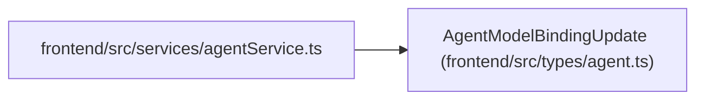

# AgentModelBindingUpdate

**Location:** `frontend/src/types/agent.ts:268`
**Kind:** Class
**Bases:** —
**Module:** [types_agent](../modules/types_agent.md)

## Description

_Auto-generated from `AgentModelBindingUpdate` in `frontend/src/types/agent.ts`._

## Attributes

| Name | Type | Required | Default | Description |
|------|------|----------|---------|-------------|
| `expected_revision` | `number` | Yes | — | — |
| `is_default` | `boolean` | No | — | — |
| `enabled` | `true` | No | — | — |
| `tool_tags` | `string[]` | No | — | — |
| `data_policy_tags` | `string[]` | No | — | — |
| `reconcile_live_assignments` | `boolean` | No | — | — |

## Methods

*No public methods. Inherits from base classes.*

## Relationships

<!-- Auto-generated relationship summary. Do not edit by hand. -->

### Summary

| Module | Methods | Attributes |
|---|---:|---|
| [types_agent](../modules/types_agent.md) | 0 | `data_policy_tags`, `enabled`, `expected_revision`, `is_default`, `reconcile_live_assignments`, `tool_tags` |

### References

| Reference | Kind | Source | Call sites |
|---|---|---|---:|
| `agentService` | import | [agentService](../modules/agentService.md) | — |
