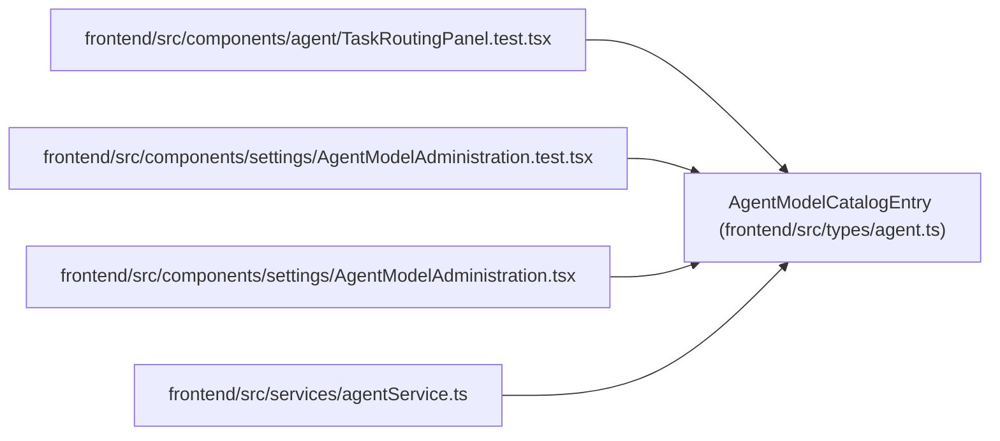

# AgentModelCatalogEntry

**Location:** `frontend/src/types/agent.ts:188`
**Kind:** Class
**Bases:** —
**Module:** [types_agent](../modules/types_agent.md)

## Description

_Auto-generated from `AgentModelCatalogEntry` in `frontend/src/types/agent.ts`._

## Attributes

| Name | Type | Required | Default | Description |
|------|------|----------|---------|-------------|
| `id` | `number` | Yes | — | — |
| `key` | `string` | Yes | — | — |
| `provider` | `string` | Yes | — | — |
| `configured_model_alias` | `string` | Yes | — | — |
| `reasoning_tier` | `ModelReasoningTier` | Yes | — | — |
| `context_tier` | `ModelContextTier` | Yes | — | — |
| `modality_tags` | `string[]` | Yes | — | — |
| `cost_tier` | `ModelCostTier` | Yes | — | — |
| `latency_tier` | `ModelLatencyTier` | Yes | — | — |
| `enabled` | `boolean` | Yes | — | — |
| `revision` | `number` | Yes | — | — |
| `last_verified_at` | `string \| null` | Yes | — | — |
| `created_at` | `string` | Yes | — | — |
| `updated_at` | `string` | Yes | — | — |

## Methods

*No public methods. Inherits from base classes.*

## Relationships

<!-- Auto-generated relationship summary. Do not edit by hand. -->

### Summary

| Module | Methods | Attributes |
|---|---:|---|
| [types_agent](../modules/types_agent.md) | 0 | `configured_model_alias`, `context_tier`, `cost_tier`, `created_at`, `enabled`, `id`, `key`, `last_verified_at`, `latency_tier`, `modality_tags`, `provider`, `reasoning_tier` |

### References

| Reference | Kind | Source | Call sites |
|---|---|---|---:|
| `TaskRoutingPanel.test` | import | [TaskRoutingPanel.test](../modules/TaskRoutingPanel.test.md) | — |
| `AgentModelAdministration.test` | import | [AgentModelAdministration.test](../modules/AgentModelAdministration.test.md) | — |
| `AgentModelAdministration` | import | [AgentModelAdministration](../modules/AgentModelAdministration.md) | — |
| `agentService` | import | [agentService](../modules/agentService.md) | — |
