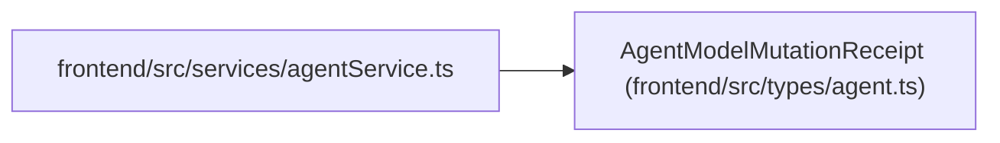

# AgentModelMutationReceipt

**Location:** `frontend/src/types/agent.ts:282`
**Kind:** Class
**Bases:** —
**Module:** [types_agent](../modules/types_agent.md)

## Description

_Auto-generated from `AgentModelMutationReceipt` in `frontend/src/types/agent.ts`._

## Attributes

| Name | Type | Required | Default | Description |
|------|------|----------|---------|-------------|
| `operation` | `string` | Yes | — | — |
| `actor_id` | `number` | Yes | — | — |
| `target_type` | `'model_catalog' \| 'model_binding'` | Yes | — | — |
| `target_id` | `number` | Yes | — | — |
| `idempotency_key` | `string` | Yes | — | — |
| `rationale` | `string` | Yes | — | — |
| `correlation_id` | `string` | Yes | — | — |
| `authoritative_revision` | `number` | Yes | — | — |
| `invalidated_assignment_ids` | `number[]` | Yes | — | — |
| `audit_event_ids` | `number[]` | Yes | — | — |
| `result` | `TResult` | Yes | — | — |

## Methods

*No public methods. Inherits from base classes.*

## Relationships

<!-- Auto-generated relationship summary. Do not edit by hand. -->

### Summary

| Module | Methods | Attributes |
|---|---:|---|
| [types_agent](../modules/types_agent.md) | 0 | `actor_id`, `audit_event_ids`, `authoritative_revision`, `correlation_id`, `idempotency_key`, `invalidated_assignment_ids`, `operation`, `rationale`, `result`, `target_id`, `target_type` |

### References

| Reference | Kind | Source | Call sites |
|---|---|---|---:|
| `agentService` | import | [agentService](../modules/agentService.md) | — |
