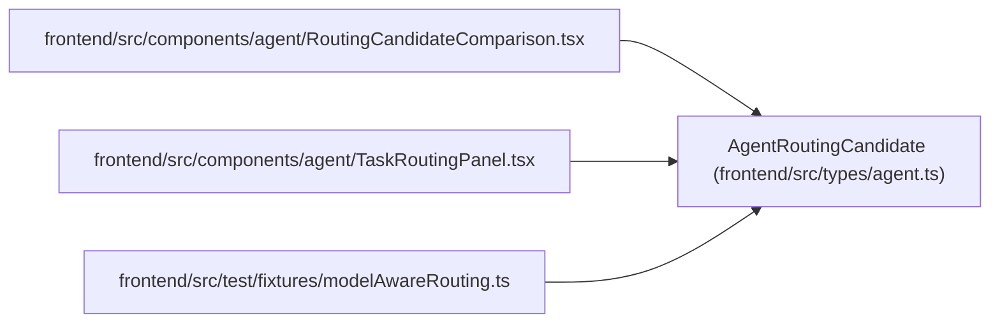

# AgentRoutingCandidate

**Location:** `frontend/src/types/agent.ts:393`
**Kind:** Class
**Bases:** —
**Module:** [types_agent](../modules/types_agent.md)

## Description

_Auto-generated from `AgentRoutingCandidate` in `frontend/src/types/agent.ts`._

## Attributes

| Name | Type | Required | Default | Description |
|------|------|----------|---------|-------------|
| `actor_id` | `number` | Yes | — | — |
| `actor_revision` | `number` | Yes | — | — |
| `actor_queue_revision` | `number` | Yes | — | — |
| `profile_id` | `number` | Yes | — | — |
| `profile_revision` | `string` | Yes | — | — |
| `capacity_owner_id` | `number \| null` | Yes | — | — |
| `capacity_owner_profile_id` | `number \| null` | Yes | — | — |
| `model_binding_id` | `number` | Yes | — | — |
| `model_binding_revision` | `number` | Yes | — | — |
| `model_catalog_id` | `number` | Yes | — | — |
| `model_catalog_key` | `string` | Yes | — | — |
| `model_catalog_revision` | `number` | Yes | — | — |
| `configured_model_alias` | `string` | Yes | — | — |
| `eligible` | `true` | Yes | — | — |
| `hard_blocker_codes` | `RoutingBlockerCode[]` | Yes | — | — |
| `matched_skill_levels` | `Record<string, TaskSkillLevel>` | Yes | — | — |
| `missing_skill_keys` | `string[]` | Yes | — | — |
| `blocking_weakness_keys` | `string[]` | Yes | — | — |
| `reasoning_tier` | `ModelReasoningTier` | Yes | — | — |
| `context_tier` | `ModelContextTier` | Yes | — | — |
| `modality_tags` | `string[]` | Yes | — | — |
| `tool_tags` | `string[]` | Yes | — | — |
| `data_policy_tags` | `string[]` | Yes | — | — |
| `cost_tier` | `ModelCostTier` | Yes | — | — |
| `latency_tier` | `ModelLatencyTier` | Yes | — | — |
| `available_capacity_days` | `number` | Yes | — | — |
| `committed_effort_days` | `number` | Yes | — | — |
| `workload_ratio` | `number` | Yes | — | — |
| `vacation_conflict` | `false` | Yes | — | — |
| `queued_assignments` | `number` | Yes | — | — |
| `accepted_assignments` | `number` | Yes | — | — |
| `running_runs` | `number` | Yes | — | — |
| `schedule_delay_days` | `number` | Yes | — | — |
| `schedule_eligible` | `true` | Yes | — | — |
| `adequacy_class` | `number` | Yes | — | — |
| `rank` | `number` | Yes | — | — |
| `confidence` | `number` | Yes | — | — |
| `rationale` | `string` | Yes | — | — |

## Methods

*No public methods. Inherits from base classes.*

## Relationships

<!-- Auto-generated relationship summary. Do not edit by hand. -->

### Summary

| Module | Methods | Attributes |
|---|---:|---|
| [types_agent](../modules/types_agent.md) | 0 | `accepted_assignments`, `actor_id`, `actor_queue_revision`, `actor_revision`, `adequacy_class`, `available_capacity_days`, `blocking_weakness_keys`, `capacity_owner_id`, `capacity_owner_profile_id`, `committed_effort_days`, `confidence`, `configured_model_alias` |

### References

| Reference | Kind | Source | Call sites |
|---|---|---|---:|
| `RoutingCandidateComparison` | import | [RoutingCandidateComparison](../modules/RoutingCandidateComparison.md) | — |
| `TaskRoutingPanel` | import | [TaskRoutingPanel](../modules/TaskRoutingPanel.md) | — |
| `modelAwareRouting` | import | [modelAwareRouting](../modules/modelAwareRouting.md) | — |
