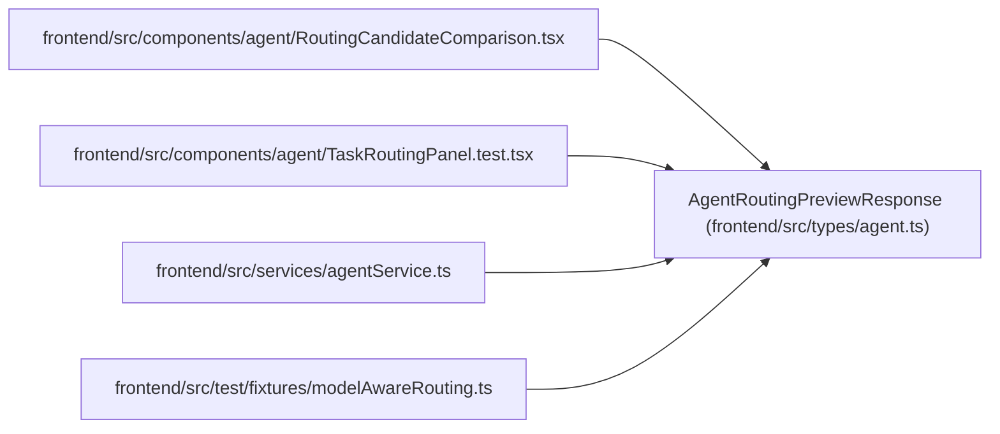

# AgentRoutingPreviewResponse

**Location:** `frontend/src/types/agent.ts:473`
**Kind:** Class
**Bases:** —
**Module:** [types_agent](../modules/types_agent.md)

## Description

_Auto-generated from `AgentRoutingPreviewResponse` in `frontend/src/types/agent.ts`._

## Attributes

| Name | Type | Required | Default | Description |
|------|------|----------|---------|-------------|
| `runtime_availability` | `'unknown'` | No | — | — |
| `eligibility_basis` | `'task_policy_and_configuration'` | No | — | — |
| `model_attestation` | `'not_independently_attested'` | No | — | — |
| `preview_id` | `string` | Yes | — | — |
| `preview_digest` | `string` | Yes | — | — |
| `input_digest` | `string` | Yes | — | — |
| `task_id` | `number` | Yes | — | — |
| `topology_key` | `string \| null` | Yes | — | — |
| `topology_revision` | `number \| null` | Yes | — | — |
| `purpose` | `AgentAssignmentPurpose` | Yes | — | — |
| `assessment_id` | `number` | Yes | — | — |
| `assessment_task_version` | `number` | Yes | — | — |
| `current_task_version` | `number` | Yes | — | — |
| `policy_version` | `'model-aware-routing-v1'` | Yes | — | — |
| `review_mode` | `TaskReviewMode` | Yes | — | — |
| `reviewer_profile_id` | `number \| null` | Yes | — | — |
| `generated_at` | `string` | Yes | — | — |
| `expires_at` | `string` | Yes | — | — |
| `recommended_candidate` | `AgentRoutingCandidate \| null` | Yes | — | — |
| `eligible_candidates` | `AgentRoutingCandidate[]` | Yes | — | — |
| `exclusions` | `AgentRoutingExclusion[]` | Yes | — | — |
| `eligible_candidates_omitted` | `number` | Yes | — | — |
| `exclusions_omitted` | `number` | Yes | — | — |
| `hard_blocker_codes` | `RoutingBlockerCode[]` | Yes | — | — |

## Methods

*No public methods. Inherits from base classes.*

## Relationships

<!-- Auto-generated relationship summary. Do not edit by hand. -->

### Summary

| Module | Methods | Attributes |
|---|---:|---|
| [types_agent](../modules/types_agent.md) | 0 | `assessment_id`, `assessment_task_version`, `current_task_version`, `eligibility_basis`, `eligible_candidates`, `eligible_candidates_omitted`, `exclusions`, `exclusions_omitted`, `expires_at`, `generated_at`, `hard_blocker_codes`, `input_digest` |

### References

| Reference | Kind | Source | Call sites |
|---|---|---|---:|
| `RoutingCandidateComparison` | import | [RoutingCandidateComparison](../modules/RoutingCandidateComparison.md) | — |
| `TaskRoutingPanel.test` | import | [TaskRoutingPanel.test](../modules/TaskRoutingPanel.test.md) | — |
| `agentService` | import | [agentService](../modules/agentService.md) | — |
| `modelAwareRouting` | import | [modelAwareRouting](../modules/modelAwareRouting.md) | — |
