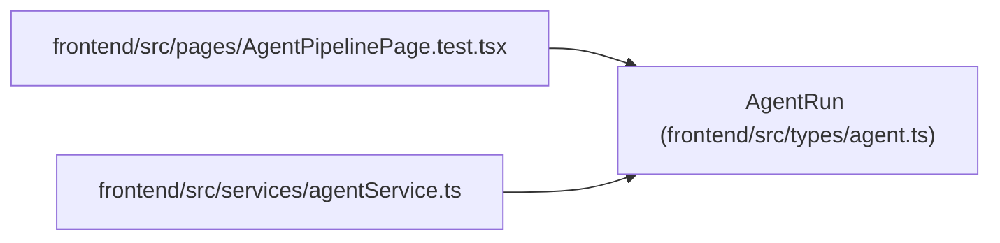

# AgentRun

**Location:** `frontend/src/types/agent.ts:578`
**Kind:** Class
**Bases:** —
**Module:** [types_agent](../modules/types_agent.md)

## Description

_Auto-generated from `AgentRun` in `frontend/src/types/agent.ts`._

## Attributes

| Name | Type | Default | Description |
|------|------|---------|-------------|
| `id` | `number` | *required* | — |
| `task_id` | `number \| null` | *required* | — |
| `actor_id` | `number` | *required* | — |
| `assignment_id` | `number \| null` | *required* | — |
| `claim_generation` | `number \| null` | *required* | — |
| `status` | `'running' \| 'succeeded' \| 'failed' \| 'canceled' \| string` | *required* | — |
| `trace_id` | `string \| null` | *required* | — |
| `model_binding_id` | `number \| null` | *required* | — |
| `model_binding_revision` | `number \| null` | *required* | — |
| `configured_model_alias` | `string \| null` | *required* | — |
| `resolved_model_id` | `string \| null` | *required* | — |
| `model_trust_state` | `AgentModelTrustState` | *required* | — |
| `model_match_basis` | `AgentModelMatchBasis \| null` | *required* | — |
| `model` | `string \| null` | *required* | — |
| `tool_name` | `string \| null` | *required* | — |
| `metadata` | `JsonObject` | *required* | — |
| `artifact_links` | `string[]` | *required* | — |
| `commit_url` | `string \| null` | *required* | — |
| `pr_url` | `string \| null` | *required* | — |
| `summary` | `string \| null` | *required* | — |
| `error` | `string \| null` | *required* | — |
| `started_at` | `string` | *required* | — |
| `ended_at` | `string \| null` | *required* | — |
| `heartbeat_at` | `string \| null` | *required* | — |
| `events` | `AgentRunEvent[]` | *required* | — |

## Methods

*No public methods. Inherits from base classes.*

## Relationships

<!-- Auto-generated relationship summary. Do not edit by hand. -->

### Summary

| Module | Methods | Attributes |
|---|---:|---|
| [types_agent](../modules/types_agent.md) | 0 | `actor_id`, `artifact_links`, `assignment_id`, `claim_generation`, `commit_url`, `configured_model_alias`, `ended_at`, `error`, `events`, `heartbeat_at`, `id`, `metadata` |

### References

| Reference | Kind | Source | Call sites |
|---|---|---|---:|
| `AgentPipelinePage.test` | import | [AgentPipelinePage.test](../modules/AgentPipelinePage.test.md) | — |
| `agentService` | import | [agentService](../modules/agentService.md) | — |
