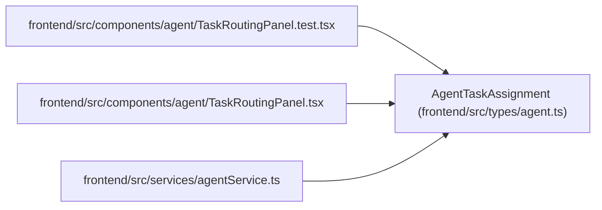

# AgentTaskAssignment

**Location:** `frontend/src/types/agent.ts:529`
**Kind:** Class
**Bases:** —
**Module:** [types_agent](../modules/types_agent.md)

## Description

_Auto-generated from `AgentTaskAssignment` in `frontend/src/types/agent.ts`._

## Attributes

| Name | Type | Required | Default | Description |
|------|------|----------|---------|-------------|
| `id` | `number` | Yes | — | — |
| `task_id` | `number` | Yes | — | — |
| `actor_id` | `number` | Yes | — | — |
| `team_member_id` | `number \| null` | Yes | — | — |
| `purpose` | `AgentAssignmentPurpose \| string` | Yes | — | — |
| `queue_class` | `AgentAssignmentQueueClass \| string` | Yes | — | — |
| `state` | `AgentAssignmentState \| string` | Yes | — | — |
| `queue_rank` | `number` | Yes | — | — |
| `not_before` | `string \| null` | Yes | — | — |
| `assigned_by_actor_id` | `number \| null` | Yes | — | — |
| `reviewer_profile_id` | `number \| null` | Yes | — | — |
| `task_version` | `number` | Yes | — | — |
| `model_binding_id` | `number \| null` | Yes | — | — |
| `model_binding_revision` | `number \| null` | Yes | — | — |
| `model_binding_status` | `AgentModelBindingStatus` | Yes | — | — |
| `model_binding_stale_reasons` | `string[]` | Yes | — | — |
| `routing_snapshot` | `JsonObject` | Yes | — | — |
| `reason` | `string \| null` | Yes | — | — |
| `created_at` | `string` | Yes | — | — |
| `updated_at` | `string` | Yes | — | — |

## Methods

*No public methods. Inherits from base classes.*

## Relationships

<!-- Auto-generated relationship summary. Do not edit by hand. -->

### Summary

| Module | Methods | Attributes |
|---|---:|---|
| [types_agent](../modules/types_agent.md) | 0 | `actor_id`, `assigned_by_actor_id`, `created_at`, `id`, `model_binding_id`, `model_binding_revision`, `model_binding_stale_reasons`, `model_binding_status`, `not_before`, `purpose`, `queue_class`, `queue_rank` |

### References

| Reference | Kind | Source | Call sites |
|---|---|---|---:|
| `TaskRoutingPanel.test` | import | [TaskRoutingPanel.test](../modules/TaskRoutingPanel.test.md) | — |
| `TaskRoutingPanel` | import | [TaskRoutingPanel](../modules/TaskRoutingPanel.md) | — |
| `agentService` | import | [agentService](../modules/agentService.md) | — |
