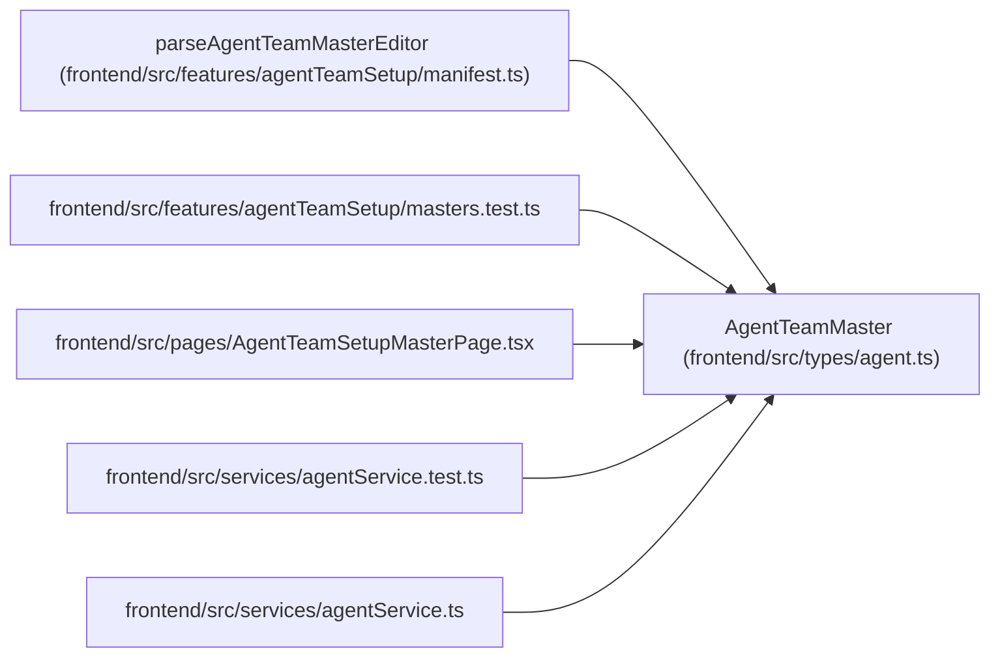

# AgentTeamMaster

**Location:** `frontend/src/types/agent.ts:664`
**Kind:** Class
**Bases:** —
**Module:** [types_agent](../modules/types_agent.md)

## Description

_Auto-generated from `AgentTeamMaster` in `frontend/src/types/agent.ts`._

## Attributes

| Name | Type | Default | Description |
|------|------|---------|-------------|
| `schema_version` | `'agent-team-master-v1'` | *required* | — |
| `topology_key` | `string` | *required* | — |
| `server_url` | `string` | *required* | — |
| `credential_sink_ref` | `string` | *required* | — |
| `required_server_features` | `string[]` | *required* | — |
| `controller` | `AgentTeamMemberSpec` | *required* | — |
| `workers` | `AgentTeamMemberSpec[]` | *required* | — |
| `verifiers` | `AgentTeamMemberSpec[]` | *required* | — |
| `readiness_policy` | `{         minimum_execution_workers: number;         require_independent_verifier_when_assessed: boolean;         maximum_runtime_staleness_seconds: number;     }` | *required* | — |

## Methods

*No public methods. Inherits from base classes.*

## Relationships

<!-- Auto-generated relationship summary. Do not edit by hand. -->

### Summary

| Module | Methods | Attributes |
|---|---:|---|
| [types_agent](../modules/types_agent.md) | 0 | `controller`, `credential_sink_ref`, `readiness_policy`, `required_server_features`, `schema_version`, `server_url`, `topology_key`, `verifiers`, `workers` |

### References

| Reference | Kind | Source | Call sites |
|---|---|---|---:|
| `parseAgentTeamMasterEditor` | type_reference | [agentTeamSetup_manifest](../modules/agentTeamSetup_manifest.md) | — |
| `masters.test` | import | [agentTeamSetup_masters.test](../modules/agentTeamSetup_masters.test.md) | — |
| `AgentTeamSetupMasterPage` | import | [AgentTeamSetupMasterPage](../modules/AgentTeamSetupMasterPage.md) | — |
| `agentService.test` | import | [agentService.test](../modules/agentService.test.md) | — |
| `agentService` | import | [agentService](../modules/agentService.md) | — |
