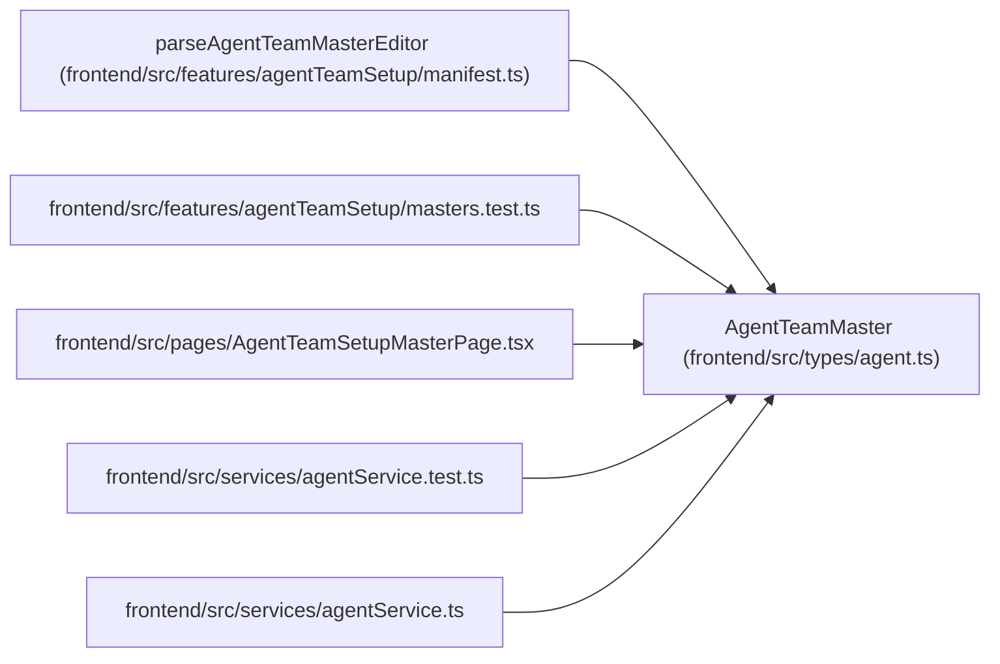

# AgentTeamMaster

**Location:** `frontend/src/types/agent.ts:668`
**Kind:** Interface
**Bases:** —
**Module:** [types_agent](../modules/types_agent.md)

## Description

_Auto-generated from `AgentTeamMaster` in `frontend/src/types/agent.ts`._

## Attributes

| Name | Type | Required | Default | Description |
|------|------|----------|---------|-------------|
| `schema_version` | `'agent-team-master-v1'` | Yes | — | — |
| `topology_key` | `string` | Yes | — | — |
| `server_url` | `string` | Yes | — | — |
| `credential_sink_ref` | `string` | Yes | — | — |
| `required_server_features` | `string[]` | Yes | — | — |
| `controller` | `AgentTeamMemberSpec` | Yes | — | — |
| `workers` | `AgentTeamMemberSpec[]` | Yes | — | — |
| `verifiers` | `AgentTeamMemberSpec[]` | Yes | — | — |
| `readiness_policy` | <pre><code>&#123;&#10;        minimum&#95;execution&#95;workers&#58; number&#59;&#10;        require&#95;independent&#95;verifier&#95;when&#95;assessed&#58; boolean&#59;&#10;        maximum&#95;runtime&#95;staleness&#95;seconds&#58; number&#59;&#10;    &#125;</code></pre> | Yes | — | — |

## Methods

*No declared methods.*

## Relationships

<!-- Auto-generated relationship summary. Do not edit by hand. -->

```mermaid
flowchart LR
    n0["AgentTeamMaster (frontend/src/types/agent.ts)"]
    n1["parseAgentTeamMasterEditor (frontend/src/features/agentTeamSetup/manifest.ts)"]
    n2["frontend/src/features/agentTeamSetup/masters.test.ts"]
    n3["frontend/src/pages/AgentTeamSetupMasterPage.tsx"]
    n4["frontend/src/services/agentService.test.ts"]
    n5["frontend/src/services/agentService.ts"]
    n1 --> n0
    n2 --> n0
    n3 --> n0
    n4 --> n0
    n5 --> n0
    click n0 "../modules/types_agent.md"
    click n1 "../modules/agentTeamSetup_manifest.md"
    click n2 "../modules/agentTeamSetup_masters.test.md"
    click n3 "../modules/AgentTeamSetupMasterPage.md"
    click n4 "../modules/agentService.test.md"
    click n5 "../modules/agentService.md"
```

### Summary

| Module | Methods | Attributes |
|---|---:|---|
| [types_agent](../modules/types_agent.md) | 0 | `controller`, `credential_sink_ref`, `readiness_policy`, `required_server_features`, `schema_version`, `server_url`, `topology_key`, `verifiers`, `workers` |

### References

| Reference | Kind | Source | Call sites |
|---|---|---|---:|
| `parseAgentTeamMasterEditor` | type_reference | [agentTeamSetup_manifest](../modules/agentTeamSetup_manifest.md) | — |
| `masters.test` | import | [agentTeamSetup_masters.test](../modules/agentTeamSetup_masters.test.md) | — |
| `AgentTeamSetupMasterPage` | import | [AgentTeamSetupMasterPage](../modules/AgentTeamSetupMasterPage.md) | — |
| `agentService.test` | import | [agentService.test](../modules/agentService.test.md) | — |
| `agentService` | import | [agentService](../modules/agentService.md) | — |
