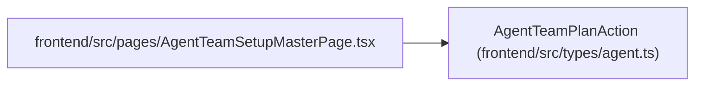

# AgentTeamPlanAction

**Location:** `frontend/src/types/agent.ts:697`
**Kind:** Class
**Bases:** —
**Module:** [types_agent](../modules/types_agent.md)

## Description

_Auto-generated from `AgentTeamPlanAction` in `frontend/src/types/agent.ts`._

## Attributes

| Name | Type | Default | Description |
|------|------|---------|-------------|
| `action_id` | `string` | *required* | — |
| `action_digest` | `string` | *required* | — |
| `reconciliation_class` | `AgentTeamReconciliationClass` | *required* | — |
| `operation` | `string` | *required* | — |
| `actor_key` | `string` | *required* | — |
| `target_actor_id` | `number \| null` | *required* | — |
| `expected_object_revision` | `number \| null` | *required* | — |
| `expected_actor_revision` | `number \| null` | *required* | — |
| `before` | `Record<string, JsonValue> \| null` | *required* | — |
| `after` | `Record<string, JsonValue> \| null` | *required* | — |
| `preconditions` | `Record<string, JsonValue>` | *required* | — |
| `blocker_code` | `string \| null` | *required* | — |
| `requires_explicit_confirmation` | `boolean` | *required* | — |
| `authority_change` | `boolean` | *required* | — |

## Methods

*No public methods. Inherits from base classes.*

## Relationships

<!-- Auto-generated relationship summary. Do not edit by hand. -->

### Summary

| Module | Methods | Attributes |
|---|---:|---|
| [types_agent](../modules/types_agent.md) | 0 | `action_digest`, `action_id`, `actor_key`, `after`, `authority_change`, `before`, `blocker_code`, `expected_actor_revision`, `expected_object_revision`, `operation`, `preconditions`, `reconciliation_class` |

### References

| Reference | Kind | Source | Call sites |
|---|---|---|---:|
| `AgentTeamSetupMasterPage` | import | [AgentTeamSetupMasterPage](../modules/AgentTeamSetupMasterPage.md) | — |
