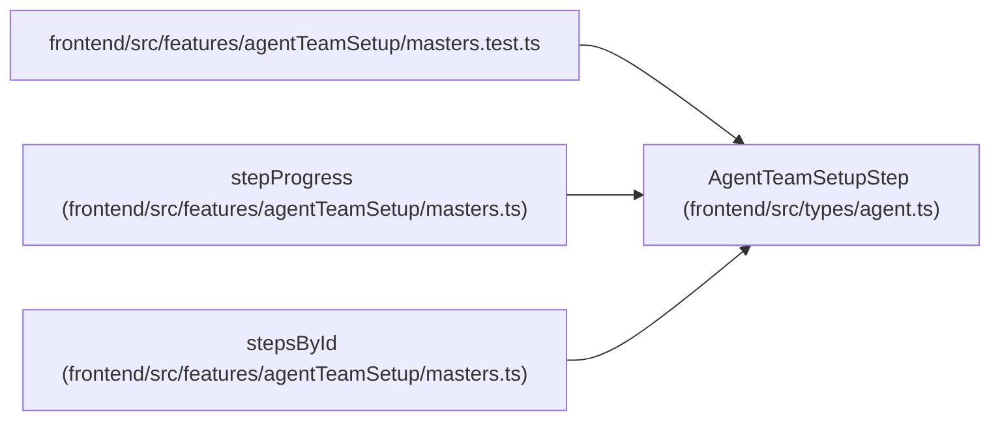

# AgentTeamSetupStep

**Location:** `frontend/src/types/agent.ts:805`
**Kind:** Class
**Bases:** —
**Module:** [types_agent](../modules/types_agent.md)

## Description

_Auto-generated from `AgentTeamSetupStep` in `frontend/src/types/agent.ts`._

## Attributes

| Name | Type | Required | Default | Description |
|------|------|----------|---------|-------------|
| `id` | `'authority' \| 'master' \| 'controller' \| 'workers' \| 'bindings' \| 'verifier' \| 'review'` | Yes | — | — |
| `state` | `AgentTeamStepState` | Yes | — | — |
| `blocker_codes` | `string[]` | Yes | — | — |
| `next_action` | `string \| null` | Yes | — | — |

## Methods

*No public methods. Inherits from base classes.*

## Relationships

<!-- Auto-generated relationship summary. Do not edit by hand. -->

### Summary

| Module | Methods | Attributes |
|---|---:|---|
| [types_agent](../modules/types_agent.md) | 0 | `blocker_codes`, `id`, `next_action`, `state` |

### References

| Reference | Kind | Source | Call sites |
|---|---|---|---:|
| `masters.test` | import | [agentTeamSetup_masters.test](../modules/agentTeamSetup_masters.test.md) | — |
| `stepProgress` | type_reference | [agentTeamSetup_masters](../modules/agentTeamSetup_masters.md) | — |
| `stepsById` | type_reference | [agentTeamSetup_masters](../modules/agentTeamSetup_masters.md) | — |
