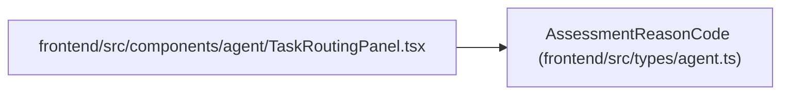

# AssessmentReasonCode

**Location:** `frontend/src/types/agent.ts:24`
**Kind:** Type alias
**Bases:** —
**Module:** [types_agent](../modules/types_agent.md)

## Description

_Auto-generated from `AssessmentReasonCode` in `frontend/src/types/agent.ts`._

## Attributes

*No annotated attributes found.*

## Methods

*No public methods. Inherits from base classes.*

## Relationships

<!-- Auto-generated relationship summary. Do not edit by hand. -->

### Summary

| Module | Methods | Attributes |
|---|---:|---|
| [types_agent](../modules/types_agent.md) | 0 | — |

### References

| Reference | Kind | Source | Call sites |
|---|---|---|---:|
| `TaskRoutingPanel` | import | [TaskRoutingPanel](../modules/TaskRoutingPanel.md) | — |
