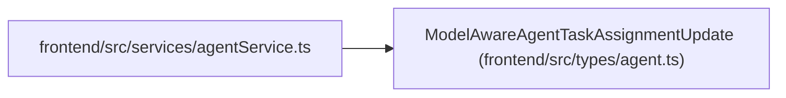

# ModelAwareAgentTaskAssignmentUpdate

**Location:** `frontend/src/types/agent.ts:514`
**Kind:** Class
**Bases:** —
**Module:** [types_agent](../modules/types_agent.md)

## Description

_Auto-generated from `ModelAwareAgentTaskAssignmentUpdate` in `frontend/src/types/agent.ts`._

## Attributes

| Name | Type | Default | Description |
|------|------|---------|-------------|
| `expected_queue_revision` | `number` | *required* | — |
| `assessment_id` | `number` | *required* | — |
| `model_binding_id` | `number` | *required* | — |
| `model_binding_revision` | `number` | *required* | — |
| `routing_preview_id` | `string` | *required* | — |
| `routing_preview_digest` | `string` | *required* | — |
| `actor_id` | `number \| null` | *required* | — |
| `reviewer_profile_id` | `number \| null` | *required* | — |
| `queue_rank` | `number \| null` | *required* | — |
| `not_before` | `string \| null` | *required* | — |
| `state` | `'queued' \| 'cancelled' \| null` | *required* | — |
| `reason` | `string \| null` | *required* | — |

## Methods

*No public methods. Inherits from base classes.*

## Relationships

<!-- Auto-generated relationship summary. Do not edit by hand. -->

### Summary

| Module | Methods | Attributes |
|---|---:|---|
| [types_agent](../modules/types_agent.md) | 0 | `actor_id`, `assessment_id`, `expected_queue_revision`, `model_binding_id`, `model_binding_revision`, `not_before`, `queue_rank`, `reason`, `reviewer_profile_id`, `routing_preview_digest`, `routing_preview_id`, `state` |

### References

| Reference | Kind | Source | Call sites |
|---|---|---|---:|
| `agentService` | import | [agentService](../modules/agentService.md) | — |
