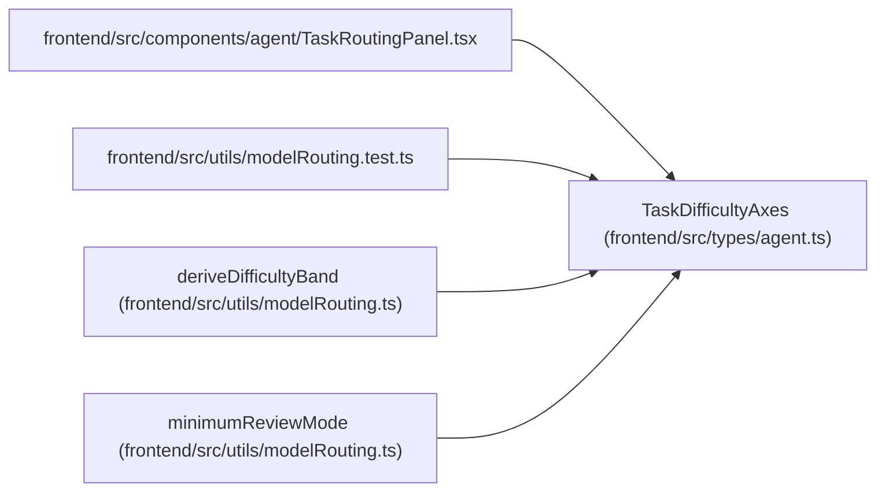

# TaskDifficultyAxes

**Location:** `frontend/src/types/agent.ts:308`
**Kind:** Class
**Bases:** —
**Module:** [types_agent](../modules/types_agent.md)

## Description

_Auto-generated from `TaskDifficultyAxes` in `frontend/src/types/agent.ts`._

## Attributes

| Name | Type | Default | Description |
|------|------|---------|-------------|
| `reasoning` | `TaskDifficultyScore` | *required* | — |
| `ambiguity` | `TaskDifficultyScore` | *required* | — |
| `context_breadth` | `TaskDifficultyScore` | *required* | — |
| `risk` | `TaskDifficultyScore` | *required* | — |
| `verification_burden` | `TaskDifficultyScore` | *required* | — |

## Methods

*No public methods. Inherits from base classes.*

## Relationships

<!-- Auto-generated relationship summary. Do not edit by hand. -->

### Summary

| Module | Methods | Attributes |
|---|---:|---|
| [types_agent](../modules/types_agent.md) | 0 | `ambiguity`, `context_breadth`, `reasoning`, `risk`, `verification_burden` |

### References

| Reference | Kind | Source | Call sites |
|---|---|---|---:|
| `TaskRoutingPanel` | import | [TaskRoutingPanel](../modules/TaskRoutingPanel.md) | — |
| `modelRouting.test` | import | [modelRouting.test](../modules/modelRouting.test.md) | — |
| `deriveDifficultyBand` | type_reference | [modelRouting](../modules/modelRouting.md) | — |
| `minimumReviewMode` | type_reference | [modelRouting](../modules/modelRouting.md) | — |
