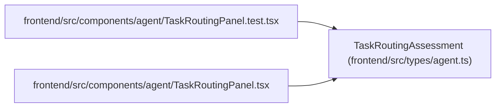

# TaskRoutingAssessment

**Location:** `frontend/src/types/agent.ts:337`
**Kind:** Class
**Bases:** —
**Module:** [types_agent](../modules/types_agent.md)

## Description

_Auto-generated from `TaskRoutingAssessment` in `frontend/src/types/agent.ts`._

## Attributes

| Name | Type | Required | Default | Description |
|------|------|----------|---------|-------------|
| `id` | `number` | Yes | — | — |
| `task_id` | `number` | Yes | — | — |
| `task_version` | `number` | Yes | — | — |
| `policy_version` | `'model-aware-routing-v1'` | Yes | — | — |
| `band` | `TaskDifficultyBand` | Yes | — | — |
| `axes` | `TaskDifficultyAxes` | Yes | — | — |
| `required_skill_levels` | `Record<string, number>` | Yes | — | — |
| `required_model` | `RequiredModelEnvelope` | Yes | — | — |
| `review_mode` | `TaskReviewMode` | Yes | — | — |
| `confidence` | `number` | Yes | — | — |
| `reason_codes` | `string[]` | Yes | — | — |
| `rationale` | `string` | Yes | — | — |
| `assessor` | `string` | Yes | — | — |
| `assessor_actor_id` | `number \| null` | Yes | — | — |
| `created_at` | `string` | Yes | — | — |
| `policy_conformant` | `boolean` | Yes | — | — |
| `is_current` | `boolean` | Yes | — | — |

## Methods

*No public methods. Inherits from base classes.*

## Relationships

<!-- Auto-generated relationship summary. Do not edit by hand. -->

### Summary

| Module | Methods | Attributes |
|---|---:|---|
| [types_agent](../modules/types_agent.md) | 0 | `assessor`, `assessor_actor_id`, `axes`, `band`, `confidence`, `created_at`, `id`, `is_current`, `policy_conformant`, `policy_version`, `rationale`, `reason_codes` |

### References

| Reference | Kind | Source | Call sites |
|---|---|---|---:|
| `TaskRoutingPanel.test` | import | [TaskRoutingPanel.test](../modules/TaskRoutingPanel.test.md) | — |
| `TaskRoutingPanel` | import | [TaskRoutingPanel](../modules/TaskRoutingPanel.md) | — |
