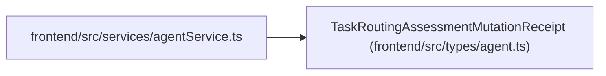

# TaskRoutingAssessmentMutationReceipt

**Location:** `frontend/src/types/agent.ts:371`
**Kind:** Class
**Bases:** —
**Module:** [types_agent](../modules/types_agent.md)

## Description

_Auto-generated from `TaskRoutingAssessmentMutationReceipt` in `frontend/src/types/agent.ts`._

## Attributes

| Name | Type | Default | Description |
|------|------|---------|-------------|
| `operation` | `'routing.assessment.create'` | *required* | — |
| `actor_id` | `number` | *required* | — |
| `target_type` | `'task_routing_assessment'` | *required* | — |
| `target_id` | `number` | *required* | — |
| `task_id` | `number` | *required* | — |
| `idempotency_key` | `string` | *required* | — |
| `rationale` | `string` | *required* | — |
| `correlation_id` | `string` | *required* | — |
| `authoritative_task_version` | `number` | *required* | — |
| `assessment` | `TaskRoutingAssessment` | *required* | — |
| `audit_event_ids` | `number[]` | *required* | — |

## Methods

*No public methods. Inherits from base classes.*

## Relationships

<!-- Auto-generated relationship summary. Do not edit by hand. -->

### Summary

| Module | Methods | Attributes |
|---|---:|---|
| [types_agent](../modules/types_agent.md) | 0 | `actor_id`, `assessment`, `audit_event_ids`, `authoritative_task_version`, `correlation_id`, `idempotency_key`, `operation`, `rationale`, `target_id`, `target_type`, `task_id` |

### References

| Reference | Kind | Source | Call sites |
|---|---|---|---:|
| `agentService` | import | [agentService](../modules/agentService.md) | — |
