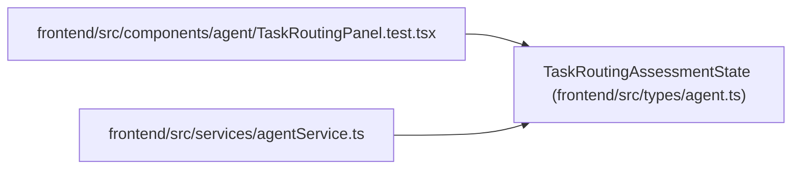

# TaskRoutingAssessmentState

**Location:** `frontend/src/types/agent.ts:356`
**Kind:** Class
**Bases:** —
**Module:** [types_agent](../modules/types_agent.md)

## Description

_Auto-generated from `TaskRoutingAssessmentState` in `frontend/src/types/agent.ts`._

## Attributes

| Name | Type | Default | Description |
|------|------|---------|-------------|
| `task_id` | `number` | *required* | — |
| `current_task_version` | `number` | *required* | — |
| `state` | `'none' \| 'current' \| 'stale'` | *required* | — |
| `assessment` | `TaskRoutingAssessment \| null` | *required* | — |

## Methods

*No public methods. Inherits from base classes.*

## Relationships

<!-- Auto-generated relationship summary. Do not edit by hand. -->

### Summary

| Module | Methods | Attributes |
|---|---:|---|
| [types_agent](../modules/types_agent.md) | 0 | `assessment`, `current_task_version`, `state`, `task_id` |

### References

| Reference | Kind | Source | Call sites |
|---|---|---|---:|
| `TaskRoutingPanel.test` | import | [TaskRoutingPanel.test](../modules/TaskRoutingPanel.test.md) | — |
| `agentService` | import | [agentService](../modules/agentService.md) | — |
