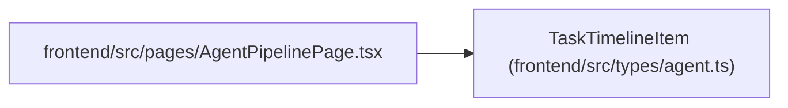

# TaskTimelineItem

**Location:** `frontend/src/types/agent.ts:617`
**Kind:** Class
**Bases:** —
**Module:** [types_agent](../modules/types_agent.md)

## Description

_Auto-generated from `TaskTimelineItem` in `frontend/src/types/agent.ts`._

## Attributes

| Name | Type | Required | Default | Description |
|------|------|----------|---------|-------------|
| `item_type` | `'task_event' \| 'status_log' \| 'agent_run' \| 'agent_run_event'` | Yes | — | — |
| `timestamp` | `string` | Yes | — | — |
| `title` | `string` | Yes | — | — |
| `payload` | `JsonObject` | Yes | — | — |
| `actor_type` | `string \| null` | No | — | — |
| `actor_id` | `number \| null` | No | — | — |
| `trace_id` | `string \| null` | No | — | — |

## Methods

*No public methods. Inherits from base classes.*

## Relationships

<!-- Auto-generated relationship summary. Do not edit by hand. -->

### Summary

| Module | Methods | Attributes |
|---|---:|---|
| [types_agent](../modules/types_agent.md) | 0 | `actor_id`, `actor_type`, `item_type`, `payload`, `timestamp`, `title`, `trace_id` |

### References

| Reference | Kind | Source | Call sites |
|---|---|---|---:|
| `AgentPipelinePage` | import | [AgentPipelinePage](../modules/AgentPipelinePage.md) | — |
