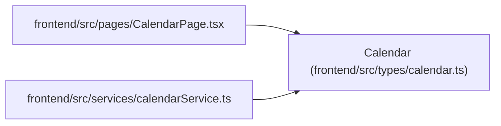

# Calendar

**Location:** `frontend/src/types/calendar.ts:1`
**Kind:** Class
**Bases:** —
**Module:** [types_calendar](../modules/types_calendar.md)

## Description

_Auto-generated from `Calendar` in `frontend/src/types/calendar.ts`._

## Attributes

| Name | Type | Default | Description |
|------|------|---------|-------------|
| `id` | `number` | *required* | — |
| `name` | `string` | *required* | — |
| `year` | `number` | *required* | — |
| `holidays` | `string[]` | *required* | — |
| `weekend_days` | `number[]` | *required* | — |
| `short_days` | `string[]` | *required* | — |

## Methods

*No public methods. Inherits from base classes.*

## Relationships

<!-- Auto-generated relationship summary. Do not edit by hand. -->

### Summary

| Module | Methods | Attributes |
|---|---:|---|
| [types_calendar](../modules/types_calendar.md) | 0 | `holidays`, `id`, `name`, `short_days`, `weekend_days`, `year` |

### References

| Reference | Kind | Source | Call sites |
|---|---|---|---:|
| `CalendarPage` | import | [CalendarPage](../modules/CalendarPage.md) | — |
| `calendarService` | import | [calendarService](../modules/calendarService.md) | — |
