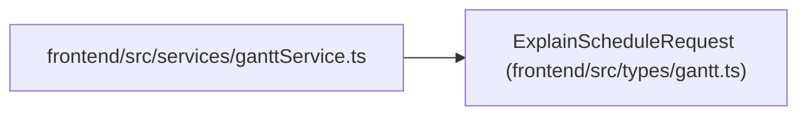

# ExplainScheduleRequest

**Location:** `frontend/src/types/gantt.ts:96`
**Kind:** Class
**Bases:** —
**Module:** [types_gantt](../modules/types_gantt.md)

## Description

_Auto-generated from `ExplainScheduleRequest` in `frontend/src/types/gantt.ts`._

## Attributes

| Name | Type | Default | Description |
|------|------|---------|-------------|
| `detail_level` | `ExplainScheduleDetailLevel` | *required* | — |

## Methods

*No public methods. Inherits from base classes.*

## Relationships

<!-- Auto-generated relationship summary. Do not edit by hand. -->

### Summary

| Module | Methods | Attributes |
|---|---:|---|
| [types_gantt](../modules/types_gantt.md) | 0 | `detail_level` |

### References

| Reference | Kind | Source | Call sites |
|---|---|---|---:|
| `ganttService` | import | [ganttService](../modules/ganttService.md) | — |
