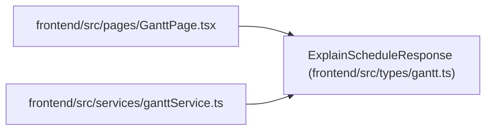

# ExplainScheduleResponse

**Location:** `frontend/src/types/gantt.ts:116`
**Kind:** Class
**Bases:** —
**Module:** [types_gantt](../modules/types_gantt.md)

## Description

_Auto-generated from `ExplainScheduleResponse` in `frontend/src/types/gantt.ts`._

## Attributes

| Name | Type | Required | Default | Description |
|------|------|----------|---------|-------------|
| `summary` | `string` | Yes | — | — |
| `decisions` | `ScheduleDecisionExplanation[]` | Yes | — | — |
| `workload_analysis` | `WorkloadAnalysis` | Yes | — | — |
| `provider` | `string \| null` | No | — | — |
| `model` | `string \| null` | No | — | — |
| `language` | `'en' \| 'ru'` | No | — | — |
| `is_fallback` | `boolean` | No | — | — |
| `finish_reason` | `string \| null` | No | — | — |
| `is_truncated` | `boolean` | No | — | — |
| `warnings` | `string[]` | No | — | — |

## Methods

*No public methods. Inherits from base classes.*

## Relationships

<!-- Auto-generated relationship summary. Do not edit by hand. -->

### Summary

| Module | Methods | Attributes |
|---|---:|---|
| [types_gantt](../modules/types_gantt.md) | 0 | `decisions`, `finish_reason`, `is_fallback`, `is_truncated`, `language`, `model`, `provider`, `summary`, `warnings`, `workload_analysis` |

### References

| Reference | Kind | Source | Call sites |
|---|---|---|---:|
| `GanttPage` | import | [GanttPage](../modules/GanttPage.md) | — |
| `ganttService` | import | [ganttService](../modules/ganttService.md) | — |
