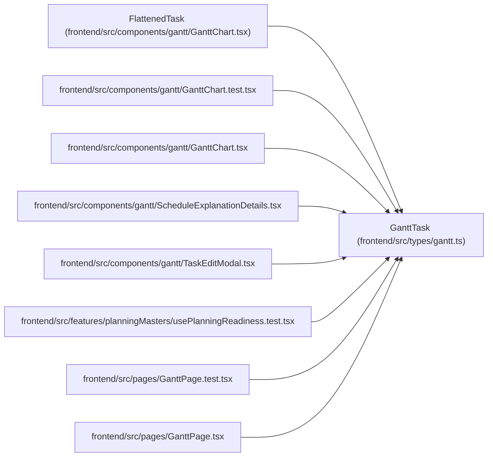

# GanttTask

**Location:** `frontend/src/types/gantt.ts:6`
**Kind:** Class
**Bases:** —
**Module:** [types_gantt](../modules/types_gantt.md)

## Description

_Auto-generated from `GanttTask` in `frontend/src/types/gantt.ts`._

## Attributes

| Name | Type | Required | Default | Description |
|------|------|----------|---------|-------------|
| `id` | `number` | Yes | — | — |
| `title` | `string` | Yes | — | — |
| `description` | `string` | No | — | — |
| `project_id` | `number \| null` | No | — | — |
| `milestone_id` | `number \| null` | No | — | — |
| `start_date` | `string \| null` | Yes | — | — |
| `end_date` | `string \| null` | Yes | — | — |
| `actual_start_date` | `string \| null` | No | — | — |
| `actual_end_date` | `string \| null` | No | — | — |
| `min_start_date` | `string \| null` | No | — | — |
| `max_end_date` | `string \| null` | No | — | — |
| `effort_days` | `number \| null` | Yes | — | — |
| `effort_hours` | `number \| null` | No | — | — |
| `calculated_effort_days` | `number \| null` | Yes | — | — |
| `progress` | `number` | Yes | — | — |
| `priority` | `number` | Yes | — | — |
| `status` | `'planned' \| 'active' \| 'resolved' \| 'closed'` | Yes | — | — |
| `is_composite` | `boolean` | Yes | — | — |
| `is_overdue` | `boolean` | Yes | — | — |
| `is_delayed` | `boolean` | Yes | — | — |
| `is_optional` | `boolean` | Yes | — | — |
| `is_deferred` | `boolean` | No | — | — |
| `is_outside_constraints` | `boolean` | Yes | — | — |
| `tags` | `string[]` | Yes | — | — |
| `milestone` | `{         id: number;         project_id: number;         name: string;         status: string;         target_date?: string \| null;     } \| null` | No | — | — |
| `assignee` | `{ id: number; name: string } \| null` | No | — | — |
| `assignees` | `Array<{ id: number; name: string }>` | Yes | — | — |
| `children` | `GanttTask[]` | Yes | — | — |
| `dependencies` | `number[]` | Yes | — | — |
| `version` | `number` | No | — | — |
| `sandbox_update` | `TaskUpdate` | No | — | — |
| `isSandboxModified` | `boolean` | No | — | — |
| `schedule_result` | `{         scheduled_start: string;         scheduled_end: string;         issues: Array<{             is_overload: boolean;             description: string;         }>;     }` | No | — | — |

## Methods

*No public methods. Inherits from base classes.*

## Relationships

<!-- Auto-generated relationship summary. Do not edit by hand. -->

### Summary

| Module | Methods | Attributes |
|---|---:|---|
| [types_gantt](../modules/types_gantt.md) | 0 | `actual_end_date`, `actual_start_date`, `assignee`, `assignees`, `calculated_effort_days`, `children`, `dependencies`, `description`, `effort_days`, `effort_hours`, `end_date`, `id` |

### Structure

| Kind | Entity | Module |
|---|---|---|
| Subclass | `FlattenedTask` | [GanttChart](../modules/GanttChart.md) |

### References

| Reference | Kind | Source | Call sites |
|---|---|---|---:|
| `GanttChart.test` | import | [GanttChart.test](../modules/GanttChart.test.md) | — |
| `GanttChart` | import | [GanttChart](../modules/GanttChart.md) | — |
| `ScheduleExplanationDetails` | import | [ScheduleExplanationDetails](../modules/ScheduleExplanationDetails.md) | — |
| `TaskEditModal` | import | [TaskEditModal](../modules/TaskEditModal.md) | — |
| `usePlanningReadiness.test` | import | [usePlanningReadiness.test](../modules/usePlanningReadiness.test.md) | — |
| `GanttPage.test` | import | [GanttPage.test](../modules/GanttPage.test.md) | — |
| `GanttPage` | import | [GanttPage](../modules/GanttPage.md) | — |
