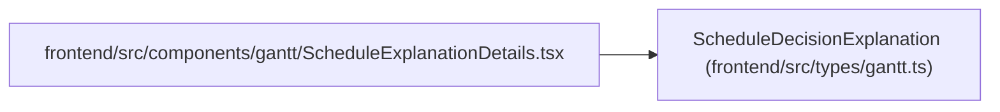

# ScheduleDecisionExplanation

**Location:** `frontend/src/types/gantt.ts:100`
**Kind:** Class
**Bases:** —
**Module:** [types_gantt](../modules/types_gantt.md)

## Description

_Auto-generated from `ScheduleDecisionExplanation` in `frontend/src/types/gantt.ts`._

## Attributes

| Name | Type | Default | Description |
|------|------|---------|-------------|
| `task_id` | `number` | *required* | — |
| `task_title` | `string` | *required* | — |
| `decision_type` | `string` | *required* | — |
| `explanation` | `string` | *required* | — |

## Methods

*No public methods. Inherits from base classes.*

## Relationships

<!-- Auto-generated relationship summary. Do not edit by hand. -->

### Summary

| Module | Methods | Attributes |
|---|---:|---|
| [types_gantt](../modules/types_gantt.md) | 0 | `decision_type`, `explanation`, `task_id`, `task_title` |

### References

| Reference | Kind | Source | Call sites |
|---|---|---|---:|
| `ScheduleExplanationDetails` | import | [ScheduleExplanationDetails](../modules/ScheduleExplanationDetails.md) | — |
