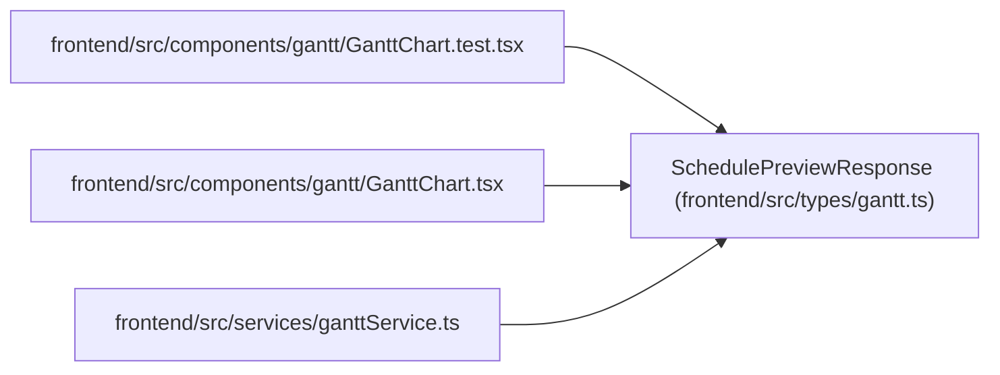

# SchedulePreviewResponse

**Location:** `frontend/src/types/gantt.ts:74`
**Kind:** Class
**Bases:** —
**Module:** [types_gantt](../modules/types_gantt.md)

## Description

Server dry-run of sandbox edits through the real scheduler (nothing persisted).

## Attributes

| Name | Type | Default | Description |
|------|------|---------|-------------|
| `tasks` | `GanttTask[]` | *required* | — |
| `overdue_task_ids` | `number[]` | *required* | — |
| `schedule_result` | `ScheduleResult \| null` | *required* | — |

## Methods

*No public methods. Inherits from base classes.*

## Relationships

<!-- Auto-generated relationship summary. Do not edit by hand. -->

### Summary

| Module | Methods | Attributes |
|---|---:|---|
| [types_gantt](../modules/types_gantt.md) | 0 | `overdue_task_ids`, `schedule_result`, `tasks` |

### References

| Reference | Kind | Source | Call sites |
|---|---|---|---:|
| `GanttChart.test` | import | [GanttChart.test](../modules/GanttChart.test.md) | — |
| `GanttChart` | import | [GanttChart](../modules/GanttChart.md) | — |
| `ganttService` | import | [ganttService](../modules/ganttService.md) | — |
