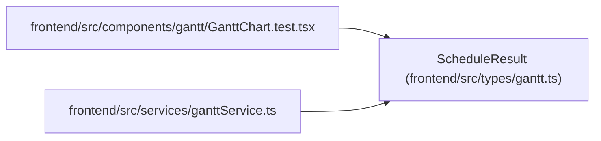

# ScheduleResult

**Location:** `frontend/src/types/gantt.ts:66`
**Kind:** Class
**Bases:** —
**Module:** [types_gantt](../modules/types_gantt.md)

## Description

_Auto-generated from `ScheduleResult` in `frontend/src/types/gantt.ts`._

## Attributes

| Name | Type | Default | Description |
|------|------|---------|-------------|
| `success` | `boolean` | *required* | — |
| `decisions` | `SchedulingDecision[]` | *required* | — |
| `workload_balanced` | `boolean` | *required* | — |
| `workload_issues` | `WorkloadIssue[]` | *required* | — |

## Methods

*No public methods. Inherits from base classes.*

## Relationships

<!-- Auto-generated relationship summary. Do not edit by hand. -->

### Summary

| Module | Methods | Attributes |
|---|---:|---|
| [types_gantt](../modules/types_gantt.md) | 0 | `decisions`, `success`, `workload_balanced`, `workload_issues` |

### References

| Reference | Kind | Source | Call sites |
|---|---|---|---:|
| `GanttChart.test` | import | [GanttChart.test](../modules/GanttChart.test.md) | — |
| `ganttService` | import | [ganttService](../modules/ganttService.md) | — |
